## Данни за отсъствия, подавани към АСП

### Кампании за подаване на данни за отсъствия

В НЕИСПУО е дадена възможност за всеки месец от учебната година да се създават кампании за подаване на данни за отсъствия от първо до четвърто число на месеца. Институциите в системата на ПУО могат да подават информация само при наличие на активна кампания за съответния месец и в периода, в който кампанията е активна.

**Пример**: Кампанията за подаване на данни за отсъствия за м. януари 2022 г. е активна от 01.02.2022 г. 0:00 часа до 04.02.2022 г. 23:59 часа. Това означава, че данни за отсъствия за м. януари 2022 г. могат да се подават само в посочения интервал.

Активните кампании по подаване на отсъствия се визуализират в модул „Деца и ученици“ на НЕИСПУО от меню „Отсъствия“, подменю „Подаване на данни за отсъствия“.

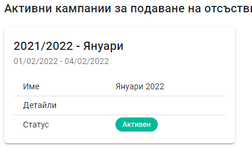

#### Настройка на начин на подаване на данни за отсъствия

Подаването на данни за отсъствия за даден месец се подават от модул „Деца и ученици“ по един от следните начини:

- Импорт на данни от файл – дадена е възможност за импорт на файл, изготвен от външна система. Използват се файлове, генерирани от външна система (електронен дневник или друг програмен продукт), чиито формат и съдържание остават непроменени спрямо използваните досега. Т.е. файловете с данни, които са били използвани за подаване на данни за отсъствия в модул „Отсъствия“, могат да бъдат импортирани от модул „Деца и ученици“.

- Импорт на данни от дневник – чрез тази опция данните за отсъствия се импортират от модул „Документи за дейността на институцията“, ако те са въведени от електронния дневник на НЕИСПУО или са постъпили в НЕИСПУО чрез интеграция на електронен дневник от друг доставчик с НЕИСПУО.

- Ръчно въвеждане – отсъствията на децата/учениците се въвежда ръчно от потребителя.

:::danger
В рамките на една кампания за подаване на отсъствия е възможно използването само на една от описаните възможности и не се допуска комбинирането им!
:::

Всяка институция посочва начина, по който ще подаде данни за отсъствия по следния начин:
1.	В модул „Деца и ученици“ се избира меню **„Потребителски профил“** (в горния десен ъгъл).

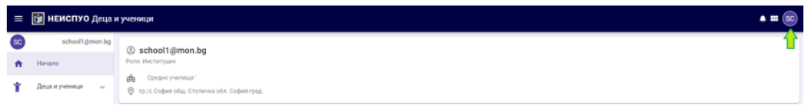

2. Избира се меню **„Профил“**

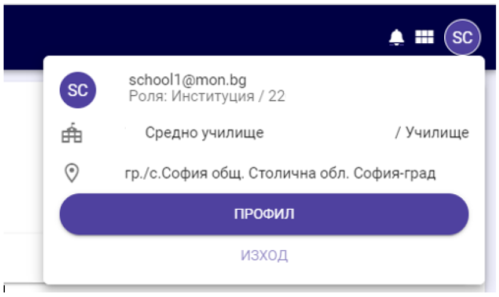

3. Избира се меню **„Настройки на приложението“** и начина на подаване на данни за отсъствия.

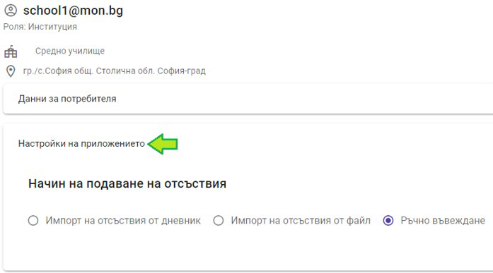

:::danger
При избор на конкретна опция останалите стават недостъпни във функционалността за подаване на данни за отсъствия!
:::

Направеният избор на начин на подаване на данните се извършва еднократно и важи за всяка следваща кампания, докато не бъде променен.

#### Подаване на данни за отсъствия чрез импорт от файл

За да бъде активна тази опция за подаване на данни за отсъствия, трябва в настройките за начин на подаване на отсъствия да е избрано **„Импорт на отсъствия от файл“** (съгласно описанието по-горе). От началния екран се избира меню **„Отсъствия“**, подменю **„Подаване на данни за отсъствия“**.

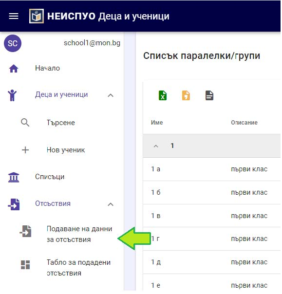

Визуализира се страница, съдържаща раздел „Импорт на данни за отсъствия“.

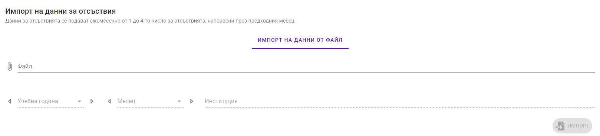

За да се избере файл с отсъствия, с мишката се избира поле „Файл“, при което се отваря стандартен файлов мениджър (windows file manager), откъдето се достига и избира импортният файл.

След избора на файл в системата се стартира процес на проверка и валидиране на данните както следва:
- Проверка за съвпадение на Код на институцията по НЕИСПУО – ако кодът на институцията, записан във файла, не съответства на кода на институцията на потребителя, се извежда съобщение за грешка „Невалиден код по НЕИСПУО на институция“.

- Проверка за съвпадение по ЕГН/ЛНЧ – ако идентификаторът (ЕГН/ЛНЧ) на дете/ученик не е намерен в базата данни за деца/ученици, се извежда съобщение за грешка „Невалиден идентификатор“ и информация за реда/редовете от файла, за които е намерено несъответствие.

- Проверка за съвпадение по випуск – ако випускът на детето/ученика, записан във файла, не съответства на випуска на детето/ученика в НЕИСПУО, се извежда съобщение за грешка „Невалидна група/паралелка“ и информация за реда/редовете от файла, за които е намерено несъответствие.

:::danger
Нито един ред от файла не се обработва и записва в НЕИСПУО, докато не бъдат отстранени всички намерени грешки!
:::

В случай че при валидирането на данните във файла не се открият грешки, се извежда съобщение за успешна проверка. Файлът може да бъде обработен и данните да постъпят (да бъдат записани) в НЕИСПУО. За целта се натиска бутон **„Импорт“**.

След приключване на импорта се извежда съобщение за успешен запис и данните за отсъствията за съответния месец се считат за обработени в НЕИСПУО. Визуализира се информация за подадения файл с възможност за преглед на подадената информация, подписване на данните, изтриване и изтегляне на обработения файл.

:::danger
Успешният импорт на данни за отсъствия чрез ръчно въвеждане, от външен файл или от електронния дневник на НЕИСПУО НЕ означава, че отсъствията са подадени. Данните трябва да бъдат ПОДПИСАНИ с електронен подпис!
:::

#### Подаване на данни за отсъствия чрез ръчно въвеждане

За да бъде активна тази опция за подаване на данни за отсъствия, трябва в настройките за начин на подаване на отсъствия да е избрано „Ръчно въвеждане“ (съгласно описанието по-горе). Ръчното въвеждане на данни за отсъствия се извършва поотделно за всяка паралелка/група от меню **„Списъци“** на началния екран. С бутон **„Детайли“** (Стъпка 2 на долната фигура) се визуализира списък на децата/учениците в паралелката/групата.

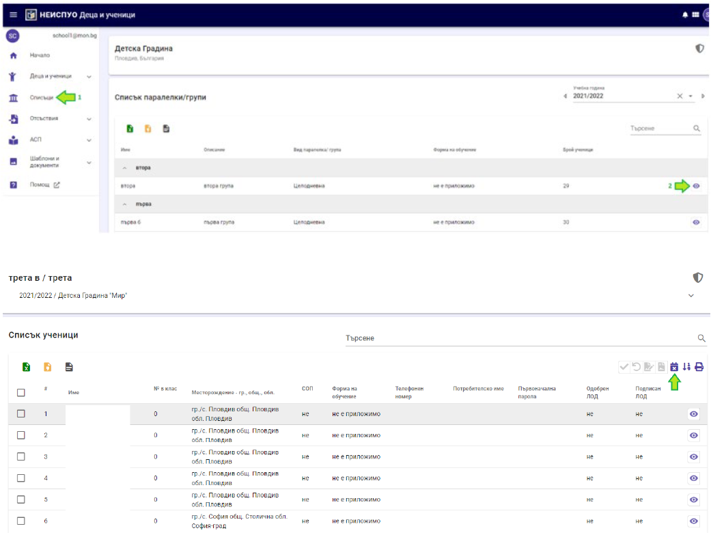

От бутон **„Отсъствия“** се дава възможност за ръчно въвеждане на данни за отсъствия за конкретен месец за всяко дете поотделно. Това се извършва от бутон **„Въвеждане“**.

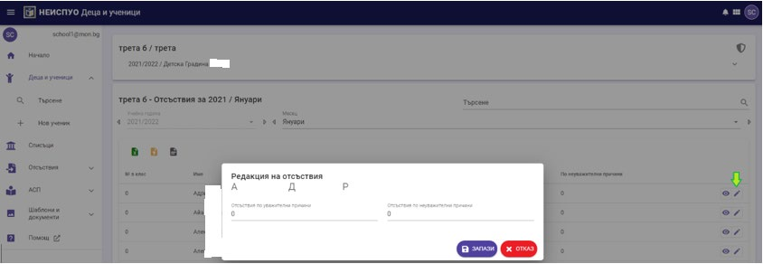

След въвеждане на брой отсъствия по уважителни/неуважителни причини, данните се записват с бутон „Запази“. Преминава се към подаване и подписване на тази данни. Това се извършва от меню „Отсъствия“, подменю „Подаване на данни за отсъствия“.

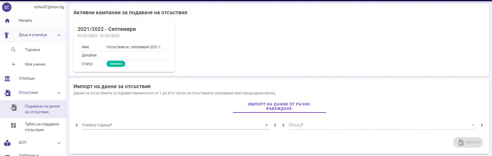

Избира се месец, за който ще се подават данни. При това се визуализира списък с всички деца от институцията, за които в системата ръчно са въведени отсъствия. Отсъствията се подават с натискане на бутон „Импорт“.

:::danger
Успешният импорт на данни за отсъствия чрез ръчно въвеждане, от външен файл или от електронния дневник на НЕИСПУО НЕ означава, че отсъствията са подадени. Данните трябва да бъдат ПОДПИСАНИ с електронен подпис!
:::

#### Подаване на данни за отсъствия чрез импорт от дневник

Чрез тази опция данните за отсъствия се импортират от модул „Документи за дейността на институцията“, ако те са въведени от електронния дневник на НЕИСПУО или са постъпили в НЕИСПУО чрез интеграция на електронен дневник от друг доставчик с НЕИСПУО.

:::danger
Ако данните за отсъствия от дневника на външен доставчик не са синхронизирани с НЕИСПУО (не са качени в НЕИСПУО), опцията за подаване на данни за отсъствия чрез импорт от дневник НЕ МОЖЕ да бъде използвана!
:::

За да бъде активна тази опция за подаване на данни за отсъствия, трябва в настройките за начин на подаване на отсъствия да е избрано „Импорт на отсъствия от дневник“ (съгласно описанието по-горе). От началния екран се избира меню **„Отсъствия“**, подменю **„Подаване на данни за отсъствия“**.

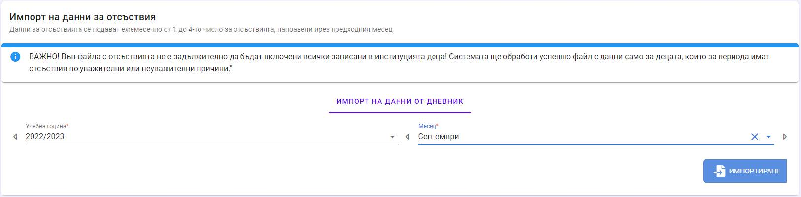

Изберете месеца, за който се подават отсъствия и натиснете бутон **„Импортиране“**. Стартира се процес по изтегляне на информация за отсъствия от дневника и след успешната обработка на данните, се визуализира съобщение за това.

:::danger
Успешният импорт на данни за отсъствия чрез ръчно въвеждане, от външен файл или от електронния дневник на НЕИСПУО НЕ означава, че отсъствията са подадени. Данните трябва да бъдат ПОДПИСАНИ с електронен подпис!
:::

:::warning
Ако при импорт на отсъствия от дневник, броят им се удвоява, то детето/ученикът има записване в повече от една подгрупа на паралелката/групата, за която има създаден един общ дневник (дневникът е за цялата паралелка/група, а не за всяка подгрупа в паралелката/групата). От профила на ученичката в НЕИСПУО, бутона с икона **"Шапка"** изтрийте записването на детето/ученика във вече невалидната подгрупа.
:::

### Деклариране на липса на отсъствия

Описаната в този раздел процедура е създадена единствено с цел обслужване на обмена на информация между МОН и АСП, необходим за организиране и координиране на дейностите по предоставяне на семейни помощи за деца, месечна социална помощ и месечна целева помощ при обявено извънредно положение или обявена извънредна епидемична обстановка. Информацията, необходима на АСП за отпускане или спиране/прекратяване на помощите, касае допуснатите отсъствия без уважителни причини от учениците и от децата от групите за задължително предучилищно образование.

Във връзка с горното, е задължително в НЕИСПУО да се подават данни за отсъствия по неуважителни причини, но е допустимо в импортните файлове да има информация и за деца/ученици, допуснали отсъствия по уважителни причини. Такива файлове се обработват успешно от НЕИСПУО.

В случай че за месеца, за който се подават отсъствия, в институцията няма деца, допуснали отсъствия по неуважителни причини, се подписва електронна декларация за липса на данни за подаване. От началния екран на системата или от меню **„Отсъствия“**, подменю **„Подаване на данни за отсъствия“** натиснете бутон **„Липсват отсъствия“**.

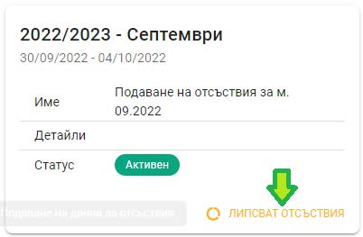

Системата ще изведе съобщение за потвърждаване на действието и ще зареди екран за подписване с електронен подпис. С електронното подписване се счита, че институцията няма данни за деца, допуснали отсъствия по неуважителни причини за периода на кампанията и с това процесът по подаване на отсъствия приключва.

### Подписване на подадени данни за отсъствия

След успешното подаване на данни за отсъствия, те трябва да бъдат подписани. За целта натиснете бутон **„Подписване“**.

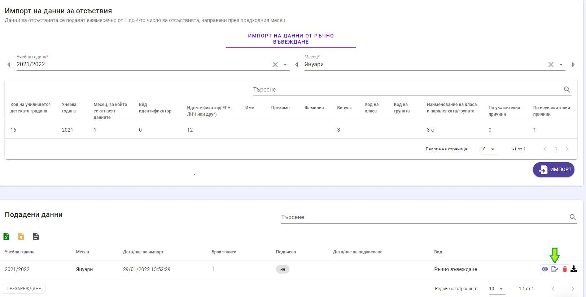

След като изберете електронния подпис, въведете неговия ПИН. Системата извежда съобщение за успешно подписване, а в списъка с подадените данни за отсъствия, се визуализира индикация, че данните са подписани.

С това всички стъпки в процеса по подаване на данни за отсъствия са изпълнени успешно. Докато кампанията за подаване на отсъствия за даден месец е активна, могат да се подават данни, като за актуални се считат последните подадени и **подписани**.

## Потвърждаване на спиране/прекратяване на месечни помощи на деца и ученици или корекция на отсъствия

### Кампании за потвърждаване на данни от АСП

В НЕИСПУО е дадена възможност за всеки месец от учебната година да се създават кампании за потвърждаване или отказване на спиране/прекратяване на месечни помощи и корекция на отсъствия по неуважителни причини/брой дни в ОРЕС. Институциите в системата на ПУО могат да потвърждават или отказват спирането и да извършват корекции на отсъствията по неуважителни причини само при наличие на активна кампания за съответния месец и в периода, в който кампанията е активна, само за лицата от списъка на АСП.

:::info
Пример: Кампанията за потвърждаване/корекция за м. януари 2022 г. е активна от 22.02.2022 г. 0:00 часа до 28.02.2022 г. 23:59 часа. Това означава, че потвърждаването/корекциите за м. януари 2022 г. може да се прави само в посочения интервал.
:::

#### Достъп до данните

Зареждането на информацията за месечните помощи, които предстоят да бъдат спрени или прекратени се извършва автоматично след получаването на файл с данни от Агенция за социално подпомагане (АСП). Файлът съдържа данни за деца:

- чиито месечни помощи предстои да бъдат спрени/прекратени;
-които фигурират в информационните масиви на АСП като отписани (неучащи в нито една институция в системата на ПУО);
- обучаващи се в ОРЕС поради въведени ограничения във връзка с извънредно положение или извънредна епидемична обстановка.

Заредените в НЕИСПУО данни за всеки месец се визуализират в модул **„Деца и ученици“**, като от началната страница на модула се избира меню **„АСП“**, подменю **„Потвърждаване на данни от АСП“**.

Визуализира се списък със заредените данни за всеки месец с информация за:
- брой заредени записи – това е броят деца/ученици, записани в институцията, за които трябва да се направи потвърждение на спирането на месечни помощи, корекция на броя отсъствия по неуважителни причини или на броя дни в ОРЕС поради въведени ограничения;
- брой записи, които не са прегледани и очакват потвърждение или корекция;
- флаг дали потвърдените/коригирани данните са подписани или не и дата и час на електронното подписване.

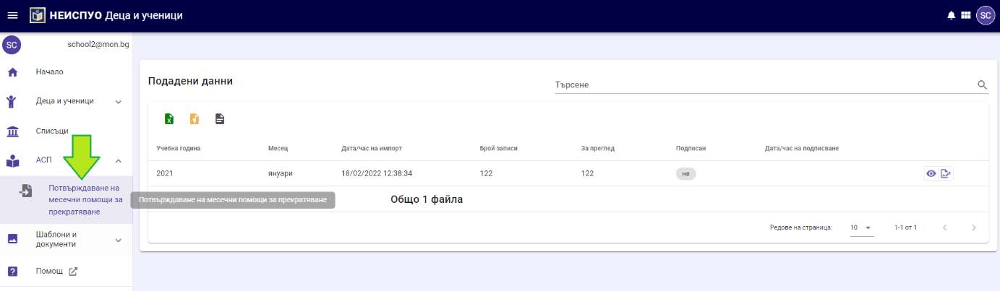

#### Преглед на данните

От бутон „Детайли“ заредените за конкретен месец данни могат да бъдат отворени за преглед.

За идентификация на детето/ученика се показват трите имена и личният образователен номер (ЛОН). Следват колони с данни, заредени от файла на АСП за месечните помощи, които предстои да бъдат спрени или прекратени.
- Отсъствия – представлява брой отсъствия (учебни часове или дни) по неуважителни причини, извършени от детето/ученика, въз основа на които предстои спирането на месечните помощи;
- АСП статус – това е флаг за вид информация:

    > Отсъствие – детето/ученикът присъства в списъка поради извършени отсъствия по неуважителни причини;

    > Отписан – детето/ученикът присъства в списъка, защото с предишни файлове е подаден към АСП като отписан и в АСП липсва информация лицето да посещава образователна институция;

    > ОРЕС - детето/ученикът присъства в списъка, защото не е посещавал училище, детска градина или предучилищна група в училище поради въведени ограничения във връзка с извънредна епидемична обстановка.

- Брой дни в ОРЕС – брой дни, в които детето/ученикът не е посещавало институцията във връзка с въведени ограничения в епидемична обстановка;
- Коригиран брой отсъствия – коригиран брой отсъствия по неуважителни причини при отказ от страна на Директора на институцията на спирането на месечните помощи;
- Коригиран брой дни в ОРЕС – коригиран брой дни, в които детето/ученикът не е посещавало институция поради въведени ограничения в епидемична обстановка;
- НЕИСПУО статус – статусът на записа за детето/ученика може да бъде:
    > За преглед – очаква отказ или потвърждение от Директора на институцията или от упълномощено от него лице;

    > Отказвам, няма основания – Директорът на институцията или от упълномощено от него лице отказват спирането на месечните помощи;

    > Потвърждавам прекратяването на месечните помощи – Директорът на институцията или от упълномощено от него лице потвърждават спирането на месечните помощи.

#### Потвърждаване/корекция на данни

За всяко дете/ученик трябва да бъде направено потвърждение на данните или те да бъдат коригирани при отказ от потвърждение и това да бъде удостоверено с електронен подпис.
Позволена е корекция на отсъствия само за децата/учениците, които са включени във файла от АСП. Не може да се извършват корекции на отсъствия на други лица.

:::danger
Системата не позволява подписването на потвържденията/ корекциите за месеца, ако има запис за дете/ученик в статус **„За преглед“**!
:::

За да потвърди/отхвърли спирането на месечните помощи или да се направи корекция на брой отсъствия/дни в ОРЕС за конкретно дете, се натиска бутон **„Редакция“** . При това се визуализира подобен екран:

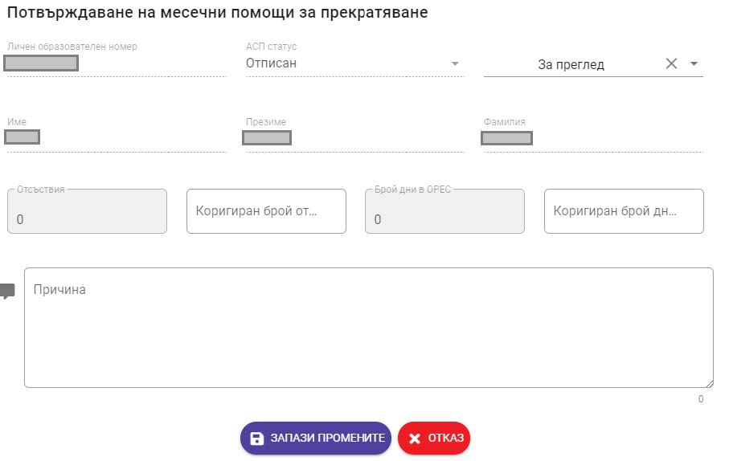

Направените промени в този екран се записват с бутон „Запази промените“, а бутон „Отказ“ служи за отказ на промените (**а не за отказване на спирането на помощите!)**. 

Потвърждаването на информацията се извършва с избор на опция **„Потвърждавам (прекратяването на помощите/брой дни в ОРЕС)“**. При потвърждаване, системата не позволява корекция на брой отсъствия или брой дни в ОРЕС.

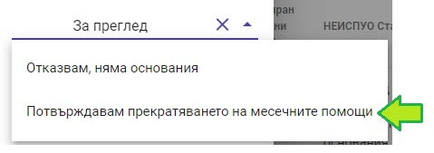

С опцията **„Отказвам, няма основание“** Директорът отказва спирането на месечните помощи поради липса на основания.

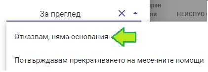

Във всички случаи системата дава възможност в полето „Причина“ да се впише под формата на свободен текст по-подробни данни за отказа или потвърждението.

- **АСП статус „Отписан“**

В този случай Директорът следва или да потвърди спирането на месечните помощи, удостоверявайки, че детето/ученикът не е записан в институцията, или да направи отказ и да запише данните.

- **АСП статус „Отсъствие“**

Потвърждаването на броя отсъствия по неуважителни причини води до спиране на месечните помощи на детето. При избор на тази опция системата не позволява корекцията на броя отсъствия. При избор на опцията **„Отказвам, няма основание“** задължително трябва да се промени броят на отсъствията, като се посочат по-малко от 5 (пет) учебни часа за ученици или по-малко от 3 (три) дни за деца в детска градина и предучилищни групи.

:::danger
Десетичният разделител е точка или запетая в зависимост от локалните настройки на компютъра! Ако разделителят е запетая, а се въведе точка, тя ще бъде игнорирана и обратно.
Пример: ако разделителят е запетая и се въведе числото 4.5, системата ще игнорира точката и ще се запише числото 45.
:::

- **АСП статус „ОРЕС“**
Потвърждаването на броя дни става с избор на опцията „Потвърждавам (прекратяването на помощите/брой дни в ОРЕС)“. При избор на тази опция системата не позволява корекцията на броя дни в ОРЕС. При избор на опцията „Отказвам, няма основание“ задължително трябва да се промени броят на дните в ОРЕС.

#### Подписване на подадени данни

След успешното потвърждаване/отказ от потвърждаване на данните за всички деца/ученици за даден месец, те трябва да бъдат подписани. За целта натиснете бутон **„Подписване“**.

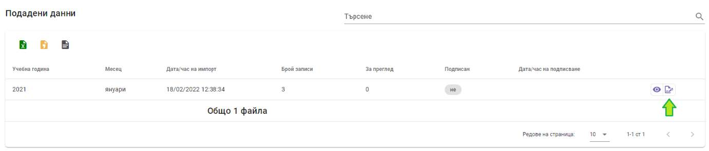

:::info
Ако не виждате бутона за подписване, моля проверете дали хоризонталният плъзгач на страницата се е появил и го преместете вдясно!
:::

Изчакайте докато системата изведе диалогов прозорец за избор на подпис. Ако такъв не се извежда, проверете дали в долната част на екрана иконата на локалното
приложение променя цвета си и я натиснете. С това диалоговият прозорец за избор на подпис ще се визуализира.

Изберете Вашия подпис. Ако той липсва, свържете се издателя на подписа за разрешаване на проблема.
След като изберете електронния подпис въведете неговия ПИН. Системата извежда съобщение за успешно подписване, а в списъка се визуализира индикация, че данните са подписани.

Докато кампанията за потвърждаване/корекция на отсъствията за даден месец е активна, могат да се подават данни, като за актуални се считат последните подадени и подписани.
За целта, в горния екран изберете бутон **„Премахване на подпис“** , натиснете бутон **„Детайли“** и направете необходимата промяна в данните.

