# Данни за Документи от Приложение №4 на Наредба №8/2016 г.

## Обща информация
В този раздел са описани функционалностите на модул „Деца и ученици“ на НЕИСПУО, с помощта на които ръчно се въвежда или подава с помощта на архивен файл информация за удостоверения, свидетелства и дипломи по Приложение №4 на НАРЕДБА № 8 от 11.08.2016 г. за информацията и документите за системата на предучилищното и училищното образование към Регистъра на документите за завършено основно образование, средно образование и/или придобита степен на професионална квалификация (Регистъра/Регистър "дипломи").
Процесът по въвеждане на информацията протича в следните стъпки:
1.	Въвеждане на общи данни за документа, институцията и ученика;
2.	Въвеждане на данни за резултати от обучението по учебни предмети/модули по раздели от учебния план;
3.  Печат на документа;
4.	Прикачване на сканирани цветни изображения на документите;
5.	Подписване на данните с електронен подпис.
6.	Алтернативен начин за подаване на информация към Регистъра е чрез архивен файл, генериран от външни програмни продукти за създаване и печат на документи.
Документите, които попадат в обхвата на Регистъра на документите за завършено основно образование, средно образование и/или придобита степен на професионална квалификация и за които трябва да бъде подадена информация през учебната 2021/2022 година, са:
- 3-20 Свидетелство за основно образование
- 3-30 Свидетелство за основно образование
- 3-30а Дубликат на свидетелство за основно образование
- 3-31 Удостоверение за завършен първи гимназиален етап
- 3-31а Дубликат на удостоверение за завършен първи гимназиален етап
- 3-32 Удостоверение за завършен втори гимназиален етап на средно образование
- 3-32a Дубликат на удостоверение за завършен втори гимназиален етап на средно образование
- 3-22.1 Приложение към удостоверение за завършен гимназиален етап (модули)
- 3-22 Удостоверение за завършен гимназиален етап
- 3-22а Дубликат на удостоверение за завършен гимназиален етап
- 3-44 Диплома за средно образование
- 3-44а Дубликат на диплома за средно образование
- 3-44.1 Приложение към диплома за средно образование (на английски език)
- 3-44.2 Приложение към диплома за средно образование (на немски език)
- 3-44.3 Приложение към диплома за средно образование (на френски език)
- 3-34 Диплома за средно образование
- 3-42 Диплома за средно образование (по стар учебен план)
- 3-34.1 Приложение към диплома за средно образование (модули)
- 3-37 Удостоверение за професионално обучение
- 3-54 Свидетелство за професионална квалификация
- 3-54а Дубликат на свидетелство за професионална квалификация
- 3-54.1 Приложение към свидетелство за професионална квалификация (модули)
- 3-101 Удостоверение за положен изпит по реда на ДЗИ за целите на кандидатстването във ВУ
- 3-102 Удостоверение за валидиране на компетентности по учебен предмет по реда на допълнителните ДЗИ
- 3-27В Удостоверение за валидиране на компетентности за начален етап/основна степен на образование/първи гимназиален етап
- 3-27аВ Дубликат на удостоверение за валидиране на компетентности за начален етап/основна степен на образование/първи гимназиален етап
- 3-37В Удостоверение за валидиране на професионална квалификация по част от професията
- 3-54В Свидетелство за валидиране на професионална квалификация
- 3-54аВ Дубликат на свидетелство за валидиране на професионална квалификация
След подписване с електронен подпис на директора на училището, документите стават достъпни в публичната част на регистъра на адрес https://regdiploms.mon.bg/ .

## Шаблони на документи
Структурата и съдържанието на всеки Документ от Приложение №4 на Наредба №8 за информацията и документите за системата на ПУО от е описан в НЕИСПУО в два основни раздела – общи данни и данни за резултатите от обучението по учебни предмети. На база на описаните схеми има възможност да се създават неограничен брой шаблони, използвани като матрица за създаване на документи за ученици, за които шаблонът е приложим. Документи за ученика могат да бъдат създавани и върху основната схема, **без да се налага да се създава шаблон**.

От началната страница на модул „Деца и ученици“ изберете меню „Шаблони и документи“, подменю „Шаблони на документи“.

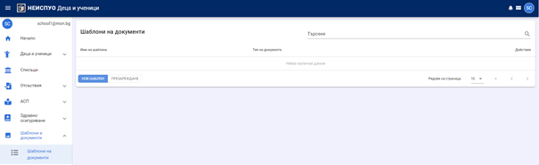

За да започнете създаването на шаблон, натиснете бутон **Нов шаблон** и изберете документ, за който желаете да направите шаблон. Дадена е възможност да се използва търсене в списъка с документи – филтриране по зададен критерий (дума или част от дума).

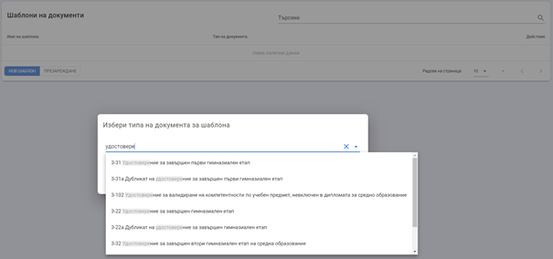

При избор на документ се зарежда подобен екран.

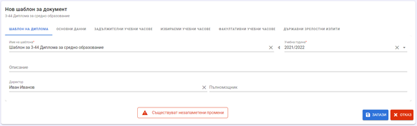

**Забележка**: В зависимост от структурата и съдържанието на конкретния документ на страницата се визуализират различни секции.
Задължително се въвежда име на шаблона и учебната година, за която той ще се използва, останалите полета са опционални. Можете да въведете стойности по подразбиране във всички секции на шаблона, както и да го запишете по всяко време от попълването му. При запис системата препраща потребителя към списъка с шаблони на институцията, откъдето е дадена възможност за редакция, изтриване и копиране. Копирането се използва за създаване на нов шаблон, подобен на избрания.

:::info
При запис на шаблон не се извършват валидации на полетата и данните и можете да запишете шаблон, в който не са попълнени полета, отбелязани като задължителни.
:::

Всеки шаблон (подобно на основните схеми на документите) има основни данни, където се описва информация за институцията, за ученика, общи данни за обучението и допълнителни данни. В раздел "Основни данни" се описва издателят на документа, серия, фабричен номер (където е приложимо), регистрационен номер и дата на регистрация.
В наименование и адрес на институцията не може да се въвежда нищо. Тези данни се попълват автоматично от системата при създаване на документ за конкретен ученик.
В поле „Рег. №“ се вписва номерът от общата номерация в съответната книга, а в поле „Рег. № за годината“ – номерът за текущата година. Попълването на тези номера в шаблона не е приложимо, тъй като всеки документ има собствен номер. Датата на регистрация в книгата може да се зададе в шаблона, защото на една дата могат да се регистрират много документи.
В данни за ученика не може да се въвежда нищо. Тази информация се попълва автоматично от системата при създаване на документ за конкретен ученик.
Тук се вписват общи данни за обучението като форма на обучение, профил, професия, специалност и друга информация, приложима за избрания вид документ.
Раздел "Допълнителни данни" се използва за задаване на стойности по подразбиране за директор, пълномощник, данни за протоколи на комисии и др.

Предметите от учебния план са организирани в отделни секции в зависимост от спецификата на бланката, върху която се отпечатва документа. Фабрично отпечатаните на бланките предмети са предварително зададени в системата и не могат да се променят. За тях може да се допълва само хорариумът.

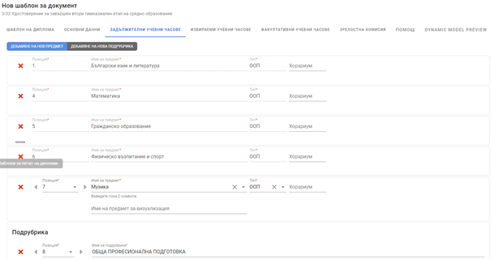

Добавянето на предмети в секцията се извършва чрез бутон **Добавяне на нов предмет**.

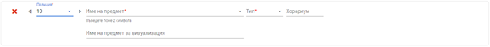

Позицията указва мястото на учебния предмет в списъка с предмети в секцията и **последователността на учебните предмети при отпечатването в съответната бланка**. В полето „Начин на изучаване“ задължително се посочва и начинът на изучаване на предмета (ООП, ПП, ОбПП и т.н.).
В полето „Име на предмет“ е дадена възможност за избор на учебен предмет от номенклатурата с учебни предмети в НЕИСПУО. **Ако наименованието на предмета трябва да се визуализира по друг начин в документа (при отпечатването му), в поле „Име на предмет за визуализация“ се посочва наименованието, което да се отпечата на бланката**.

С помощта на бутон **Добавяне на нова подрубрика** в предварително зададените рубрики (секции) с резултати по учебни предмети, може да се създават подрубрики (подсекции). Пример за използването на подрубрики е 3-44 Диплома за средно образование. Чрез функционалността за създаване на подрубрики, в секцията ЗАДЪЛЖИТЕЛНИ УЧЕБНИ ЧАСОВЕ могат да се създадат подрубрики ПРОФИЛИРАНА ПОДГОТОВКА, РАЗШИРЕНА ПОДГОТОВА, ОТРАСЛОВА ПРОФЕСИОНАЛНА ПОДГОТОВКА и други. На фигурата по-долу е даден пример за задаване на ОбПП в секцията от предметите в ЗУЧ.

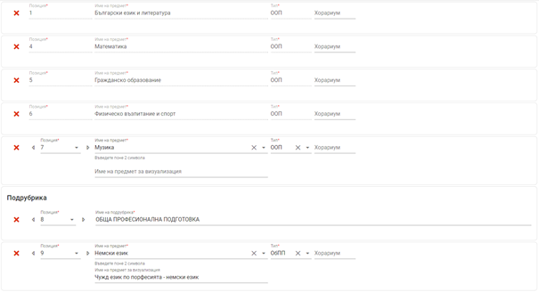

Позицията на подрубриката, както и на учебните предмети в секцията (основната рубрика) трябва да са последователни и да отразяват реда, по който следва да бъдат отпечатани на бланката.

## Документи
### Създаване на документи в НЕИСПУО
Документи (дипломи, свидетелства, удостоверения и др.) за конкретен ученик се създават от профила на ученика в НЕИСПУО, меню „Дипломи“.

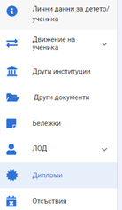

С бутон **Нова диплома** се визуализира диалогов прозорец, от който се избира видът на документа и шаблон, върху който да се нанесат конкретните данни за ученика. **Не е задължително да се използва шаблон**. Документът може да се създаде и въз основа на схемата по подразбиране, въведена в НЕИСПУО от нейните администратори.

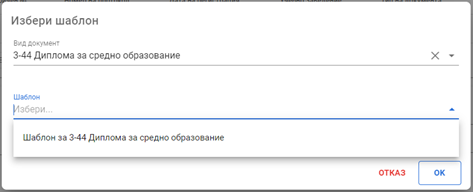

В основните данни за документа автоматично се зарежда информация за институцията и ученика и трябва да се попълни останалата информация.
Документът не може да се запише, докато не се въведат всички задължителни полета, включително и в секциите с резултати от обучението.
След запис на документа системата пренасочва потребителя към списък с всички документи, издадени на ученика. Документът може да се редактира от бутон **Редакция**  .

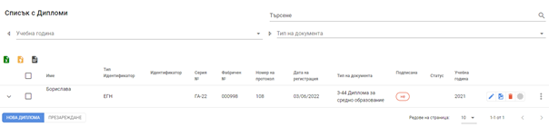

При създаване на документ има възможност в предварително зададените рубрики (секции) с резултати по учебни предмети да се създават подрубрики (подсекции). Начинът на въвеждането им е аналогичен на описания по-горе в раздел "Шаблони на документи".
### Оценки
Резултати от обучението се въвеждат в разделите, следващи „Основни данни“.

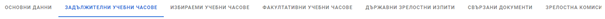

При въвеждане на оценките по учебни предмети има възможност да се избира категорията на оценката:
- Оценка – с качествен и количествен и количествен показател;
- СОП оценка – избор от „Среща затруднения“, „Справя се“ и „Постига изискванията“;
- Друга оценка – „Зачита се“, „Не се зачита“, „Освободен“, „Интензивно“ и „Без оценка“.

:::info
При избор на "Без оценка" в документа се отпечатва тире!
:::

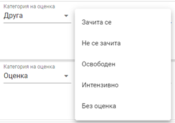

При попълване на оценки от НВО и ДЗИ е дадена възможност да се въведат точките от изпита и нивото на владеене на чужд език.
За учебни предмети, които са изучавани на чужд език, може да се избере чуждият език и хорариумът, за които предметът е изучаван на чужд език. За целта се поставя отметка пред „Изучаван на чужд език“ и се въвежда език и хорариум.

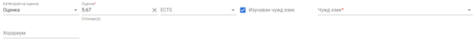

При създаване на Приложения към диплома за средно образование (номенклатурни номера 3-44.1, 3-44.2 и 3-44.3) се въвеждат и оценки по ECTS. Резултатите от държавните зрелостни изпити се трансформират по ECTS скала за оценяване, както следва:
- оценка А се поставя при резултат отличен 6,00;
- оценка В се поставя при резултат отличен 5,50 - 5,99;
- оценка С се поставя при резултат много добър 4,50 - 5,49;
- оценка D се поставя при резултат добър 3,50 - 4,49;
 -оценка E се поставя при резултат среден 3,00 - 3,49.

 ### Свързани документи
 Тази секция е предвидена **само** за случаите, в които се издава дубликат на документ или приложение към него и се вписват данните за основния документ. За 3-44 Диплома за средно образование тук се въвежда номер на документа, удостоверяващ завършване на първи гимназиален етап. В случай че се издава 3-44а Дубликат на диплома за средно образование, като втори документ се описват и данните за дипломата. В полето за институция се избира училището, издало оригинала.

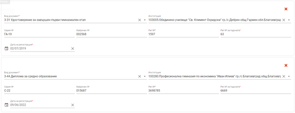

### Зрелостна комисия
В тази секция се въвеждат номер и заповед, както и членовете на зрелостната комисия – **само** за 3-34 Диплома за средно образование!

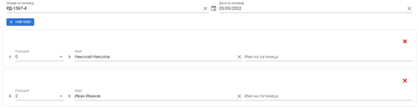

## Печат на документи
Създаденият документ може да бъде разпечатан от списъка с документите чрез бутон **Печат**.

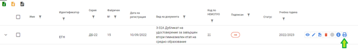

Отваря се следният диалогов прозорец.

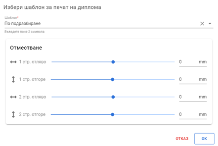

В зависимост от позиционирането на полетата, които трябва да се попълнят в бланката при печат, е дадена възможност за настройка на отместването на всички полета при печата. Настойката на отместването може да се прави за всяка страница. Отместването се настройва в милиметри, като за отместване надолу и надясно се посочват положителни числа, за отместване нагоре и наляво – отрицателни. Възможно е в зависимост от конкретното устройство за печат да има отклонения от описаното в предходното изречение.
След настройка на отместванията, натиснете бутон **OK**, за да преминете на следващата стъпка. В нея документът се визуализира за оглед така, както ще бъде отпечатан върху бланката. От бутона **Печат** се отваря диалогов прозорец за избор на настройките при разпечатване.

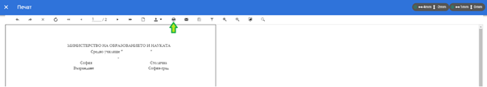

В зависимост от използвания браузър, се визуализират различни екрани. На следващата фигура е представен екранът на Google Chrome.

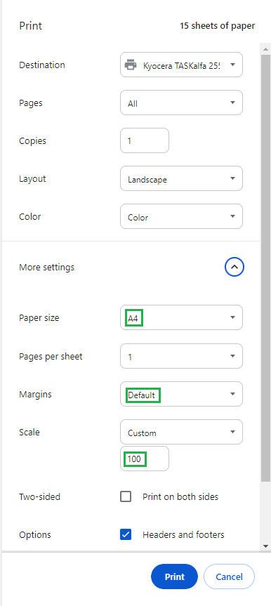

Уверете се, че сте:
- избрали печатащото устройство, до което желаете да изпратите команда за печат (Destination);
- поставили правилно бланката в листоподаващото отделение на печатащото устройство;
- избрали страницата, която желаете да отпечатате;
- избрали сте формат на листа А4 (Paper size);
- скалата е Default или 100%.

## Шаблони за печат
В YouTube канала на МОН, на адрес https://www.youtube.com/watch?v=uPxSBn7h7BI&t=1443s , можете да гледате уебинар по темата.

В НЕИСПУО е дадена възможност за настройка на матрици (шаблони) за печат, като за всеки вид документ потребителят може да направи своя матрица, която да използва при печата на документи. В нея може да се настройва големината на шрифта, вида на шрифта, позицията на поле в документа и др.
Функционалните възможности са разяснени със следния пример – въпреки настройките за отместване при печата на диплома за средно образование, имената на ученика не попадат на желаната позиция и само това поле трябва да се отмести нагоре. За да постигнете желания резултат и да отместите само имената на детето нагоре и само в този вид документ, от началната страница на модул „Деца и ученици“ изберете меню „Шаблони и документи“, подменю „Шаблони за печат на дипломи“. Визуализира се списък с Вашите шаблони (матрици).

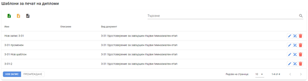

За да направите нов шаблон, изберете **Нов запис**.

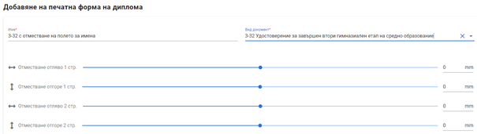

Въведете име на шаблона (свободен текст) и изберете вида на документа, за който желаете да създадете персонализиран шаблон. Оттук можете да настроите и отстъпите, с които желаете да се отместят всички полета при печат на този вид документ, за да не се налага да ги въвеждате при отпечатването на всеки документ.

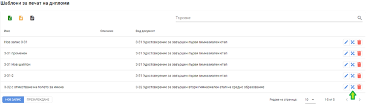

С бутон **Дизайн** се преминава към дизайна на промените по конкретни полета в документа.

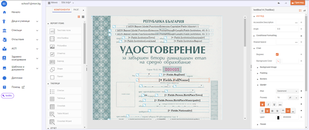

За да се премести позицията на конкретно поле, се маркира полето и със задържане на десния бутон на мишката, то се премества на нова позиция. За по-прецизна работа, след маркиране на полето, то може да се мести и със стрелките от клавиатурата. Големината и видът на шрифта се променят от меню „ИЗГЛЕД“ (в дясната чат на екрана), подменю „Стил“, раздел „Шрифт“.
С натискане на бутон „ПРЕГЛЕД“ промените се запазват и документът, с направените промени се отваря за оглед.
При печат на конкретен документ създадената матрица може да бъде избрана и използвана за печат на документ.

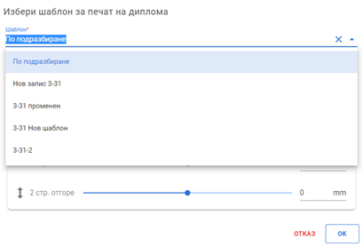

## Прикачване на изображения
Освен описаните данни за документите, в Регистъра трябва да се прикачат и сканираните изображения на всички страници от документа. Прикачването става от бутон **Прикачени документи**. От бутон **Добави** се отваря диалогов прозорец, в който от файловата система на компютъра се избира предварително сканираното изображение.

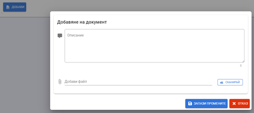

Когато сканиращото устройство е свързано локално към компютъра (не се използва мрежово устройство), може да се използва вградената в НЕИСПУО функционалност за сканиране. С натискане на бутон **Сканирай**, документът ще се сканира и прикачи автоматично.
Сканираните изображения се прикачват едно по едно.

:::warning
За да работи автоматичното сканиране в НЕИСПУО, е необходимо на компютъра да бъде инсталиран локалният сървър, с помощта на който се извършва и подписването с КЕП (електронен подпис) в системата.
:::

## Подписване на документ
След като се прикачат сканираните изображения на документите, данните и изображенията трябва да се подпишат с електронен подпис. Подписването се извършва по начина, утвърден в НЕИСПУО, с помощта на локалния сървър за подписване.
За да подпишете документа, в списъка с документи сложете отметка пред онзи/онези, които желаете да подпишете. Дадена е възможност да се подпишат няколко документа едновременно.

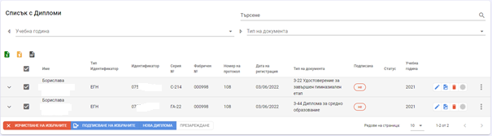

С бутон **Изчистване на избраните** се премахват всички поставени в списъка отметки. С бутон **Подписване на избраните** се стартира процесът по подписване с локалния сървър. След успешното подписване в списъка се показва индикация, че документите са подписани и са качени в Регистъра.

**За документи, които не са в обхвата на Регистъра, не се изисква подписване** и това се визуализира в списъка с документите.

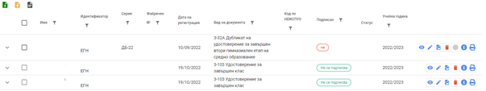

### Редактиране на подписан документ
В случай че се налага корекция на подписан документ, той трябва да бъде отключен за редакция. Това става от бутон **Отключване за редакция**. Задължително трябва да се въведе причината за редакция. При това статусът на документа се променя на „Отключена за редакция“, но докато не са направени промени в данните, документът все още е достъпен в публичния сайт на Регистъра. При запис на промяна в документа, той се премахва от Регистъра и трябва да се подпише отново, за да се публикува там.

### Анулиране на документ
В случай че подписан и качен в Регистъра документ трябва да се изтрие или обяви за невалиден, той трябва да се отбележи в НЕИСПУО като анулиран. Това се извършва с бутон **Анулиране**. Неподписани документи не могат да се анулират. При анулирането на документа той се премахва от Регистъра, но остава видим в ЛОД на ученика с цел проследимост и пълнота на информацията.

## Импорт от файл
В този раздел е описана процедурата по подаване на данни към Регистър дипломи чрез архивен файл, генериран от външни програмни продукти за създаване и печат на документи.
Предварително условие за импорт на файлове от външно приложение е приложението да има разработена функционалност за генериране на файлове, съдържащи информация за документи, издадени от институцията, по определена спецификация за структура и формат, публикувана на адрес https://extapi-neispuo.mon.bg/students/diploma .

Един файл съдържа данни за точно един документ. Файлове, които не отговарят на тази спецификация, не могат да бъдат обработени от НЕИСПУО. В един архивен файл може да се съдържат данни за повече от един документ. **Няма** ограничение за броя файлове (документи) в един архив, но е препоръчително документите да се подават на по-малки пакети – например за една паралелка. При подаване на файла в НЕИСПУО се извършват проверки за валидна структура и съдържание съгласно техническата спецификация. Невалидни по структура и съдържание архиви не се обработват от НЕИСПУО. Архивът трябва да бъде в zip формат.

Качването на файлов архив в НЕИСПУО се извършва от модул „Деца и ученици“, начална страница, меню „Дипломи“.

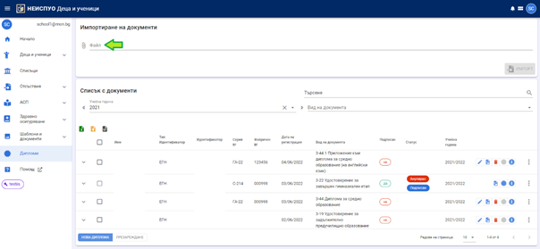

Изберете файла и натиснете бутон **Импорт**. Започва проверка на файловете и при намерени грешки се визуализира подобен екран.

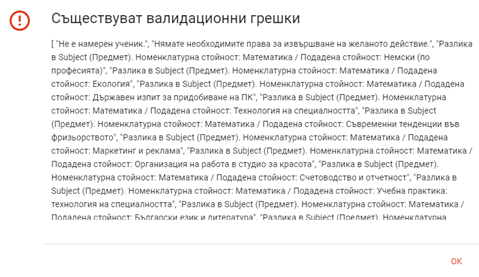

Грешките могат да се групират в три групи:
- Потребителски – допуснати от потребителя при работа със системите;
- Проблеми в приложението, генерирало архива – отстраняват се от разработчика на приложението;
- Проблеми в НЕИСПУО – отстраняват се от разработчика на НЕИСПУО.
Детайли за грешката се визуализират с бутон **Виж детайли за последната грешка**.

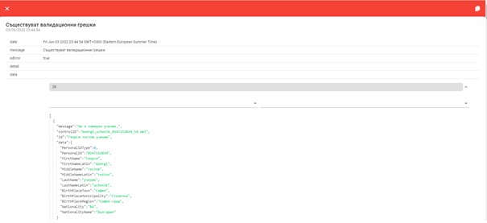

С бутон **Копиране**, разположен в горния десен ъгъл, грешките се копират и може да бъдат поставени в текстов файл, който да се изпрати за анализ и отстраняване до разработчика на външното приложение или НЕИСПУО.

След успешната обработка на импортния файл се преминава към подписване на импортираните документи.
За проблеми и затруднения при работа с описаната функционалност на НЕИСПУО следва да подадете заявка в системата за поддръжка на НЕИСПУО на адрес https://helpdesk-neispuo.mon.bg/ .

## Документи извън Регистъра, създадени извън НЕИСПУО
Информация за документи **извън** обхвата на Регистър дипломи, създадени и отпечатани извън НЕИСПУО чрез външни приложения, се въвежда в профила на детето/ученика, меню „Други документи“.

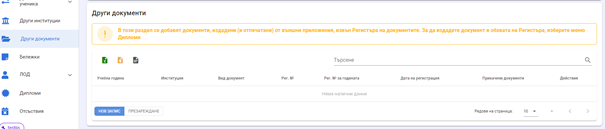
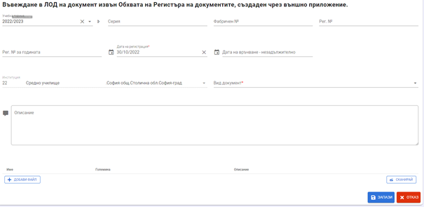

## Регистрационни номера
Общ регистрационен номер и регистрационен номер за годината се взима от НЕИСПУО. За всеки вид документ се води отделна номерация.
От началната страница на модул „Деца и ученици“ изберете меню „Шаблони и документи“, подменю „Номера на документи“.

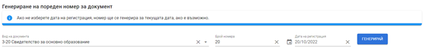

Изберете вид документ, брой необходими номера, дата на регистрация и натиснете бутон „Генерирай“. Преди системата на генерира номерата, се извършва проверка дали за избрания документ няма генерирани номера с по-късна дата на регистрация от избраната. Ако има, се извежда съобщение за грешка. Проверката се прави с цел спазване на последователност и хронология в регистрационните книги.

След постъпване на информация за издадения документ в НЕИСПУО се визуализира информация дали номерът е използван.

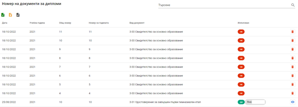

Регистрационните книги се водят **само** в електронен вид и са достъпни от меню "Регистрационни книги" в началната страница. Те представляват само визуализация на данни за документи, постъпили в НЕИСПУО по някой от гореописаните начини.

## Дубликати на документи
Процесът по въвеждане на информацията протича в следните стъпки:

1.	Търсене (и при необходимост) въвеждане на данни за лице
2.	Въвеждане на общи данни за документа, институцията и ученика;
3.	Въвеждане на данни за резултати от обучението по учебни предмети/модули по раздели от учебния план;
4.	Прикачване на сканирани цветни изображения на документите;
5.	Подписване на данните с електронен подпис.
6.	Алтернативен начин за подаване на информация към Регистъра е чрез архивен файл, генериран от външни програмни продукти за създаване и печат на документи.

Дубликатите, които попадат в обхвата на Регистъра на документите за завършено основно образование, средно образование и/или придобита степен на професионална квалификация и за които трябва да бъде подавана информация към Регистъра, са:

- 3-30а Дубликат на свидетелство за основно образование
- 3-31а Дубликат на удостоверение за завършен първи гимназиален етап
- 3-32a Дубликат на удостоверение за завършен втори гимназиален етап на средно образование
- 3-22а Дубликат на удостоверение за завършен гимназиален етап
- 3-44а Дубликат на диплома за средно образование
- 3-54а Дубликат на свидетелство за професионална квалификация
- 3-27аВ Дубликат на удостоверение за валидиране на компетентности за начален етап/основна степен на образование/първи гимназиален етап
- 3-54аВ Дубликат на свидетелство за валидиране на професионална квалификация

След подписване с електронен подпис на Директора на училището, документите стават достъпни в публичната част на регистъра на адрес https://regdiploms.mon.bg/ . Няма промяна в начина на търсене и проверка на дипломи, удостоверения и свидетелства в публичния сайт.

### Ръчно въвеждане на дубликат в НЕИСПУО
Ако изберете тази възможност за въвеждане на данни за дубликат, следвайте долуописаните стъпки:

- В модул „Деца и ученици“ потърсете лицето, за което желаете да въведете дубликат. От меню „Деца и ученици“, подменю „Търсене“ въведете критериите за търсене. Използвайте търсене по идентификатор с избрана опция „Точно съвпадение“ и изключена опция „Търси само в моята институция“.

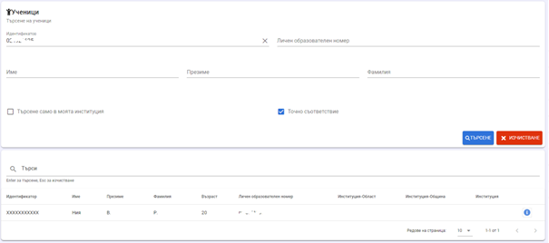

- Ако лицето не е намерено в НЕИСПУО, трябва да го създадете от меню „Деца и ученици“, подменю „Нов ученик“.
- **НЕ е необходимо да записвате лицето в институцията и да го разпределяте в конкретна паралелка/група!**
- От меню „Дипломи“ в началната страница натиснете бутон „Нов“ и изберете вида на дубликата.
- Въведете основните данни за дубликата.

:::danger
**В поле „Учебна година на издаване на дубликата“ въведете учебната година, през която издавате дубликата, а не учебната година на завършване/полагане на изпити/валидиране/приравняване за лицето!**
:::
- Въвеждането на резултатите от обучението (учебни предмети/модули и оценки) не е задължително, но е допустимо.
- Задължително е да въведете данни за оригиналния документ в секция „Свързани документи“.
    В полетата за регистрационни номера, които за задължителни, но не разполагате с данни, въведете „тире“.
    Ако датата на регистриране на документа в съответната книга е неизвестна, впишете датата на регистриране на дубликата.
- Запишете дубликата.
- Прикачете цветни сканирани изображения на документа.
- Подпишете документа.

### Импорт на файл с данни за дубликат
Ако изберете тази възможност за въвеждане на данни за дубликат, следвайте долуописаните стъпки:
- В модул „Деца и ученици“ потърсете лицето, за което желаете да въведете дубликат. От меню „Деца и ученици“, подменю „Търсене“ въведете критериите за търсене. Използвайте търсене по идентификатор с избрана опция „Точно съвпадение“ и изключена опция „Търси само в моята институция“.

- Ако лицето не е намерено в НЕИСПУО, трябва да го създадете от меню „Деца и ученици“, подменю „Нов ученик“.
- **Не се налага да записвате лицето в институцията!**
- Импортирайте файла.
- Подпишете документа.

