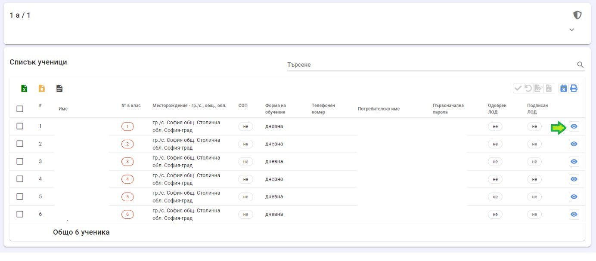
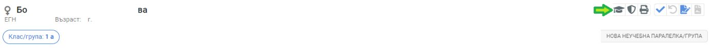
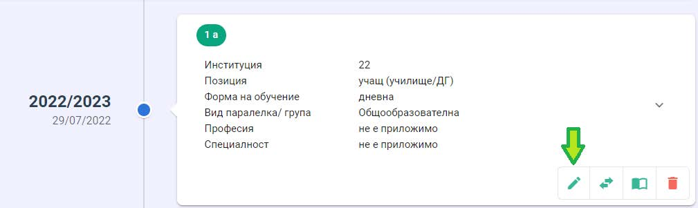
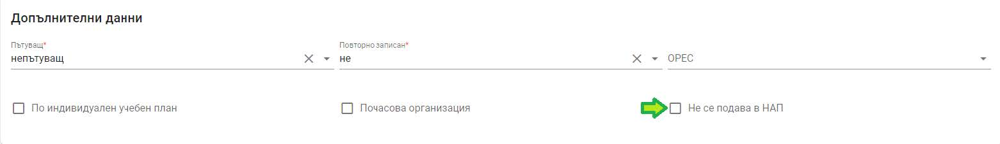
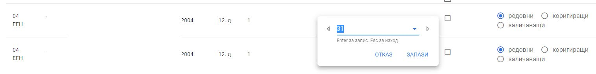
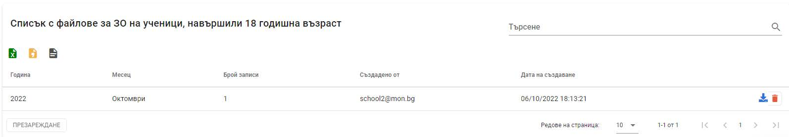

# Здравно осигуряване

Целта на настоящия раздел е да опише функционалностите на модул „Деца и ученици“ на НЕИСПУО, с помощта на които се въвежда информация за здравно осигуряване на учениците и ежемесечно изпращане на данни за здравно осигуряване на учениците над 18 години към Нционална агенция за приходите (НАП).

Изпращането на информацията към НАП се извършва чрез генериране и сваляне на файл с данни в електронен вид с Декларация обр. №3 "Данни за здравно осигуряване на лица, осигурени от държавния бюджет" от Наредба № Н-8 от 29 декември 2005 г. за съдържанието, сроковете, начина и реда за подаване и съхранение на данни от работодателите, осигурителите за осигурените при тях лица, както и от самоосигуряващите се лица. Структурата и форматът на файла са специфицирани от НАП.

При генерирането на файла с данни за здравно осигуряване на учениците над 18 години се спазват следните условия:

- Включват се ученици, които са навършили 18 годишна възраст в месеца, за който се подават данните, или са навършили тази възраст в предходен месец.
- Учениците трябва да се записани в учебни паралелки (включително и служебната) и при записване в клас **НЕ Е** поставена отметката „Не се подава в НАП“.
- Когато ученикът е навършил 18 години в предходен месец, се подава информация за здравно осигуряване от първо до последно число на месеца, за който се подават данни.
- Когато ученикът навършва 18 години в текущия месец, той подлежи на здравно осигуряване от деня, следващ този, в който се навършват 18 години до края на месеца. 

Осигурителната сума се изчислява спрямо този период.

- Ако ученикът е напуснал институцията през месеца, за който се подава информация за здравно осигуряване, се подава ден, до който се внасят вноски, равен на деня на датата на отписване.
- При корекция или заличаване на данни за Декларация обр. №3 трябва да има пълно съвпадение между данните, които следва да бъдат коригирани/заличени и коригиращите/заличаващите данни на следните полета от декларацията: месец, година, код на задълженото лице, ЕГН/ЛНЧ/Служебен номер и вид осигурен. Това условие следва да се прилага за всички години.

## Предварителна подготовка

За да подготвите данните за здравно осигуряване на учениците над 18 години, които следва да се подадат към НАП, следвайте долуописаните стъпки:

1. Влезте в профила на ученика (от меню **„Списъци“**, избор на паралелка, вход в профила на ученика)

2. Изберете бутон **„Класове“**

3. Изберете бутон **„Редакция“** от картата на ученика в текущата учебна паралелка/група.

4. Ако в раздел **„Допълнителни данни“** има поставена отметка пред **„Не се подава в НАП“**, премахнете я (където е приложимо).

Можете да достъпите профила на ученика и чрез опцията за търсене на ученик.

## Създаване на файл за НАП

От началния екран на модул **"Деца и ученици"** изберете меню **„Здравно осигуряване“**, подменю **„Данни за ЗО на ученици, навършили 18 годишна възраст“**. Визуализира се списък с ученици съгласно условията, описани по-горе.

**Задължително** изберете коректни месец и година, за които желаете да създадете файл за здравно осигуряване.

## Редакция на ден от/до който се внасят осигуровки

Системата изчислява и извежда ден, от който и до който се внасят осигуровки, но данните могат да се променят. За целта натиснете левия бутон на мишката върху числата „Ден, от който се внасят вноски“ или „Ден, до който се внасят осигуровки“ и нанесете промените.

## Изключване от списъка

Ако желаете даден ученик да не бъде записан във файла, който ще се подаде към НАП, поставете отметка в **„Изключи от списъка“**.

## Корекции и заличаване

При необходимост от корекция или заличаване на данни, изберете в десния край на реда за конкретния ученик опция „коригиращи“ или „заличаващи“ данни. Изберете и месец и година, за който желаете да заличите или коригирате данни.

## Генериране на файл

За да експортирате файл за НАП от НЕИСПУО, натиснете бутон **Създаване на файл**. В долната част на страницата, след списъка с ученици, ще се визуализира подобна карта:

От бутон **„Изтегляне“** можете да свалите създадения файл (файлът ще бъде свален в папката, зададена в настройките на браузера за съхранение на изтеглени файлове). С бутон **„Изтриване“** можете да изтриете създадения файл.

:::warning
Всяко натискане на бутон **„Създаване на файл“** води до презаписване на вече създаден такъв.
:::

:::danger
В случай че данни за лице, навършило 18 годишна възраст, не са подавани към НАП за минали периоди поради наличие на отметка "Не се подава в НАП", следва да се изполват алтернативни решения за подаване на Декларация №3. Такъв вариант е използването на приложение, което може да се изтегли от интернет страницата на НАП -  https://nra.bg/wps/portal/nra/Programni-produkti/Programni-produkti-za-obhvashtane0-na-danni-ot-deklaracii-ob1-ob3-ob6
:::