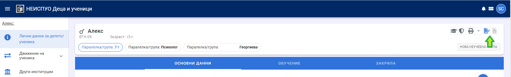
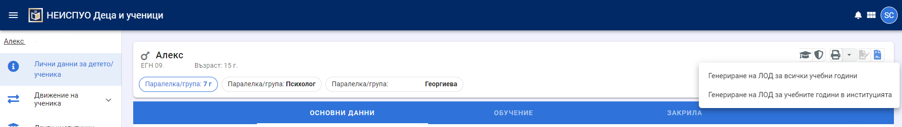
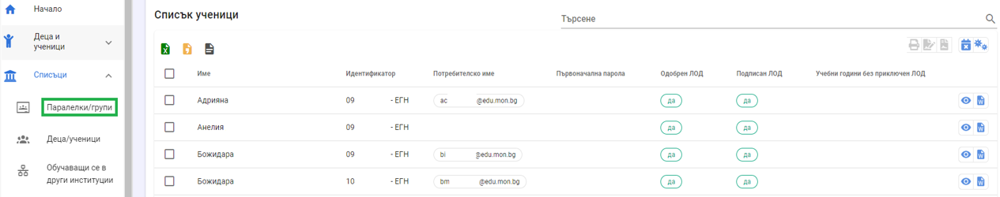
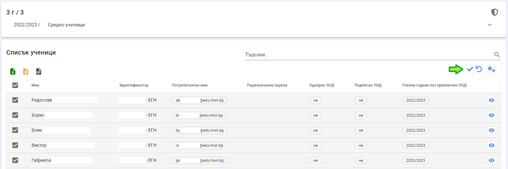
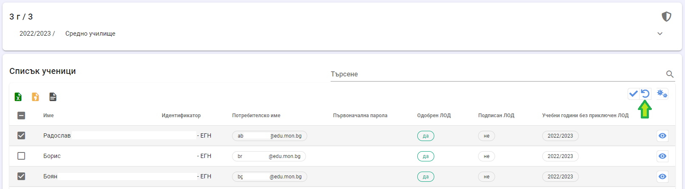
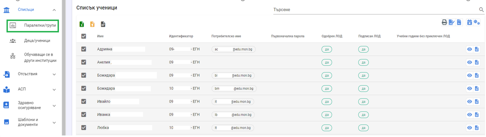
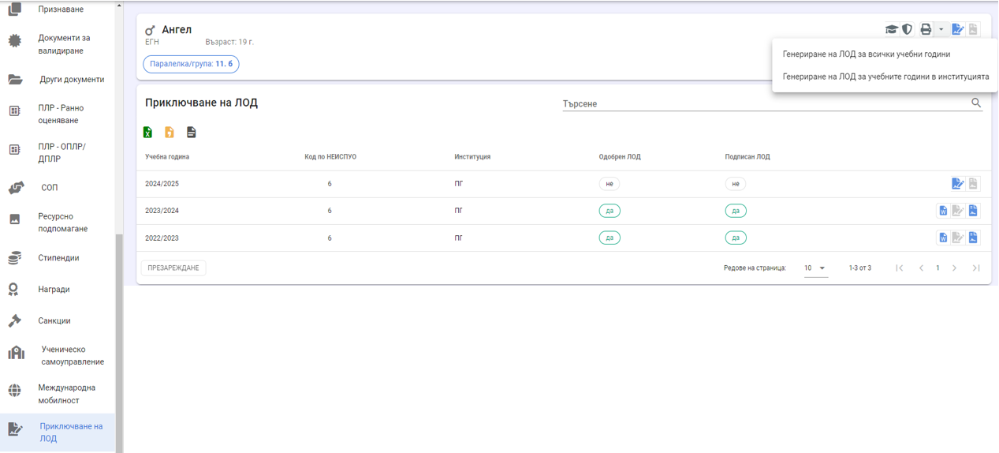

# Приключване на ЛОД
Съгласно Чл.19, ал.1 от НАРЕДБА №8/2016 г. за информацията и документите за системата на предучилищното и училищното образование Личното образователно дело (ЛОД) се създава при постъпване на детето или ученика в системата на задължителното предучилищно и училищно образование и се води до завършване на средно образование или отписване от училище (отпадане от образователната система).

Съгласно **Чл.20, ал.2** от НАРЕДБА №8/2016 г. за информацията и документите за системата на предучилищното и училищното образование Директорът на институцията организира и контролира приключването на работата по личното образователно дело за всяко дете/ученик за съответната учебна година, като:
1. Приключва работата по електронната партида при преместване на детето/ученика в учебно време след издаване на удостоверение за преместване;
:::danger
Действия в НЕИСПУО - разпечатва се ЛОД, но **НЕ СЕ** подисва!
:::
2. Приключва работата по електронната партида и я подписва с електронен подпис при отписване на детето/ученика;
:::danger
Действия в НЕИСПУО - разпечатва се ЛОД и се подисва!
:::
3. Подписва с електронен подпис личното образователно дело при успешно завършена учебна година от детето/ученика.
:::danger
Действия в НЕИСПУО - ЛОД се подисва, разпечатва се само за децата/учениците, напускащи институцията!
:::
Разпечатката на личното образователно дело на хартиен носител съдържа информация за учебните години, в които детето/ученикът се е обучавал в съответната институция.

## Приключване на ЛОД за едно дете/ученик за ТЕКУЩАТА учебна година
Приключването на ЛОД за конкретно дете/ученик може да се извърши през неговия профил.

От бутон **Подписване на ЛОД** се приключва и подписва електронната партида за учебната година, в която е институцията. Подписът на приключен ЛОД може да бъде премахнат от бутон **Отмяна на подпис на ЛОД**. Това действие може да се извърши само от потребителят, подписал ЛОД и само в рамките на текущата учебната година. Подписан през една учебна година ЛОД не може да бъде отключен оттук през следваща учебна година.

За разпечатването на ЛОД са дадени две възможности - печат на ЛОД за всички учебни години или печат на ЛОД за учебните години, през които лицето се е обучавало в институцията.

Когато дете/ученик се отписва или премества, системата автоматично генерира ЛОД за учебните години, през които лицето се е обучавало в институцията, който следва да се разпечата и съхранява в институцията в сроковете, предвидени в Наредба №8/2016 г.

Файловете, които се генерират от тук, имат информативен характер и служат за онагледяване на данни, въведени в разделите на ЛОД за всички учебни години или за учебните години в институцията. **Не следва да се свалят, съхраняват и разпечатват!**

## Приключване на ЛОД в края на учебната година
В края на учебната година, преди преминаване в нова, всички ЛОД на децата/учениците, завършващи годината, трябва да са прегледани за пълнота на информацията и подписани с електронен подпис от директора на институцията. **Преминаването в нова учебна година и приключването на дневниците не изисква всички ЛОД да са приключени!** Допуска се наличието на неподписани ЛОД за учениците, които ще полагат поправителни изпити по учебни предмети или ДЗИ през сесията август-септември. Разпечатват се само ЛОД на деца и ученици, които напускат институцията.

При успешно полагане на поправителните изпити резултатите се нанасят в дневника и автоматично се визуализират в ЛОД. Ако дневникът е приключен, се отключва, нанасят се резултатите и отново се заключва. При външен доставчик на дневник – действията се извършват съгласно указанията на разработчика на външния дневник.
За явяващите се на ДЗИ на сесия август-септември - при успешно полагане на ДЗИ се издава диплома за средно образование.

:::info
Препоръчително е преди подаването на Списък-образец през м. декември учениците, които не са положили успешно ДЗИ, да се отпишат от институцията.
:::

Приключването на ЛОД на учениците може да се извърши или по гореописания начин (ученик по ученик), или за всички ученици от една паралелка или деца от една група. Вторият начин е по-удобен и е достъпен от меню "Списъци" в началния екран на модул "Деца и ученици".

Бутон **"W"** сваля файл (ЛОД) с подписаните за конкретната учебна година данни. Файлът има информативен характер и служи за онагледяване на всички данни, въведени в разделите на ЛОД. **Не следва да се сваля, съхранява и разпечатва.**

В общия случай оформянето на ЛОД и проверката за пълнота и коректност на информацията се извършва от класните ръководители и след това ЛОД се подписват от директора. За улеснение на директора е дадена възможност на класните ръководители да отбележат, че ЛОД са проверени и одобрени от тях и очакват подпис. **Не е задължително ЛОД да са одобрени от класните ръководители, преди да бъдат подписани от директора!** Одобрението има за цел само да информира директора, че ЛОД са проверени и готови за подписване.

За да одобрите ЛОД, от меню "Списъци" на началната страница изберете група/паралелка, маркирайте ЛОД, които желаете да одобрите (или изберете "Всички"), и натиснете бутон **Одобрение на ЛОД**.

Има възможност одобрението на ЛОД да бъде премахнато. От списъка на учениците в класа изберете онези, на които желаете да премахнете одобрението и натиснете бутон **Отмяна на одобрение на ЛОД**

Одобрението от класен ръководител може да премахне само този потребител, който е одобрил ЛОД. Затова е **препоръчително ЛОД да се подписва с институционален акаунт, за да е възможна отмяна на подписа при смяна на директора или отнемане на директорския достъп на оправомощени лица**. Не може да се премахне одобрение на вече подписан ЛОД.

## Разпечатване на ЛОД в края на учебната година

Бутонът с икона "принтер" генерира архив (zip файл), съдържащ docx файлове (ЛОД) на всички избрани ученици. Файловете са подписани и съдържат информация за учебните години, в които децата/учениците са се обучавали в институцията.

:::danger
За напускащите институцията деца/ученици тези файлове се разпечатват и съхраняват по реда на Наредба №8/2016!

За деца/ученици, които продължават обучението си в институцията, подобен zip файл не следва да се създава, съхранява и съдържаието му да се разпечатва!
:::

## Приключване на ЛОД за едно дете/ученик за минали години

От профила да детето/ученика изберете меню **ЛОД**, подменю **"Приклчване на ЛОД"**. Визуализира се статуса на ЛОД на детето/ученика за всички учебни години след 2022/2023.Дадена е възможност за подписване и отмяна на подписа на ЛОД за избрана учебна година. Може да се използва за случаи, в които ЛОД не е подписан за дадена учебна година, а институцията е преминала в нова. Действията са позволени, само ако ученикът е записан в институцията (може и да не е разпределен в клас/група).

Бутон **"W"** сваля файл (ЛОД) с подписаните за конкретната учебна година данни. Файлът има информативен характер и служи за онагледяване на всички данни, въведени в разделите на ЛОД. **Не следва да се сваля, съхранява и разпечатва.**

