# Начало

След успешен вход (и избор на роля) се визуализира началният екран на
модул "Деца и ученици".

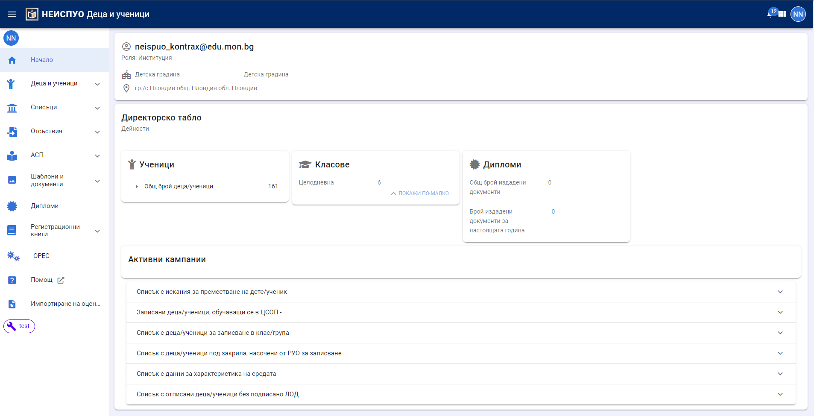

В горния десен ъгъл се вижда името на потребителя, работещ с модула.

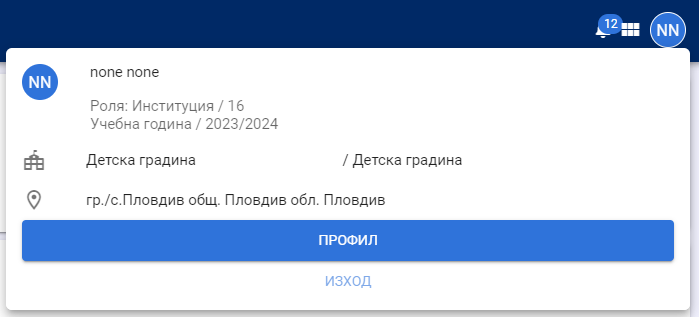

С натискане на левия бутон на мишката върху името на потребителя се дава възможност за 
преглед на **Профил** и **Изход** от системата.

В началния екран на модула се вижда информация за:

-   Институцията;
-   Децата и учениците;
-   Паралелките и групите;
-   Кампаниите за подаване на отсъствия към АСП;
-   Кампаниите за потвърждаване на спирането на помощи, предоставяни от АСП;
-   Шаблони и документи по Приложение №4 на Наредба №8 от 2016г.;
-   Издадени документи по Приложение №4 на Наредба №8 от 2016г.;
-   Регистрационни книги за издадени документи по Приложение №4 на Наредба №8 от 2016г.
-   ОРЕС.

На директорското табло се визуализират следните данни:

## Ученици

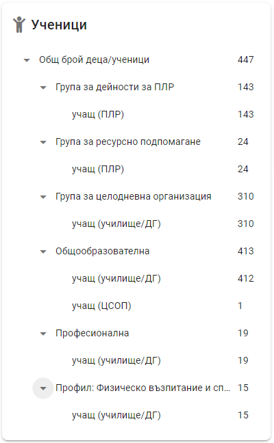

В тази карта се показва броят на децата/учениците, групирани по вида на паралелката/групата,
в която са записани и по позиция. Общият брой деца/ученици е възможно да надвишава броя учениците,
обучаващи се в институцията. Това се сължи на факта, че едно дете/ученик може да е записано както
в учебна паралелка, така и в група/и за ПЛР, ЦДО и др.

## Паралелки/групи

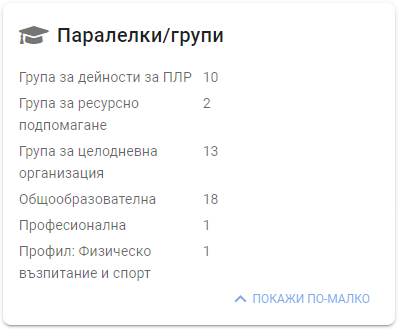

В тази карта се показва броят на паралелките и групите в институцията,
групирани по вид.

**Списък с искания за преместване на дете/ученик**

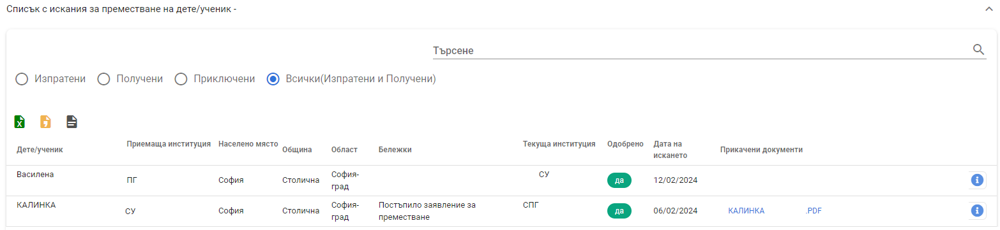

В този списък се визуализират изпратените и постъпилите искания за записване на деца и ученици.

При избор на филтъра "Изпратени" се визуализират само изпратените към други институции искания за записване на
деца/ученици.

При избор на филтъра "Получени" се визуализират само получените от други институции искания за записване на
деца/ученици.

Приключени са такива искания, които са изпратени или получени, детето/ученикът е записано в приемащата институция
и изпращащата институция е създала документ за преместване със статус "Потвърден".

От бутон "i" се зарежда профила на детето/ученика в НЕИСПУО.

## Деца/ученици, обучаващи се в ЦСОП

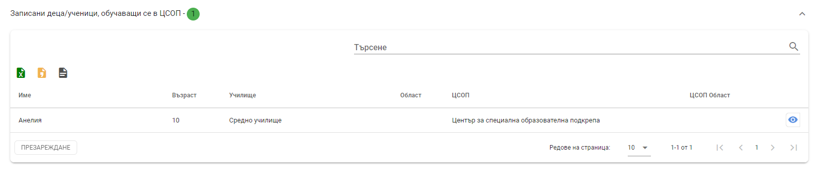

От гледна точка на училище/ДГ този списък съдържа деца/ученици, записани с позиция "учащ (училище/ДГ)" в институцията, които 
се обучават в ЦСОП. От гледна точка на ЦСОП този списък съдържа деца/ученици, записани с позиция "учащ (друга институция)", т.е. записани в учебни паралелки в ЦСОП.
Записаните в двца и ученици в неучебни групи в ЦСОП не се визуализират в този списък.

:::warning
При подаване на Списък образец №3 за деца и ученици, които са записани в ЦСОП, но не са записани в училище/ДГ, се сигнализира валидационна ГРЕШКА.

При подаване на Списък образец №1 за деца и ученици, които са записани в институцията с позиция "учащ (училище/ДГ)", но не са записани в ЦСОП,
се сигнализира валидационна ГРЕШКА.
:::

## Деца/ученици за записване в клас/група

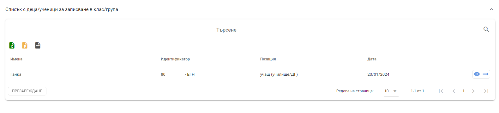

Това е списък с деца/ученици, записани в институцията, които не са разпределени в нито една учебна паралелка/група.

Записването на детето/ученика се извършва с натискане на бутон "стрелка" или от неговия профил в НЕИСПУО, документи за записване.

:::warning
При подаване на Списък образец за деца и ученици, присъстващи в този списък, се сигнализира валидационна ГРЕШКА.
:::

## Деца/ученици под закрила, насочени от РУО за записване

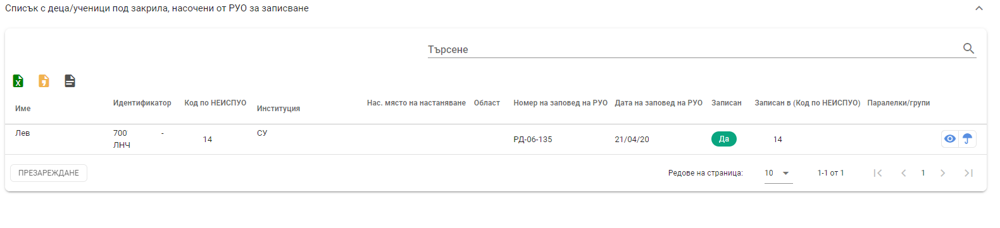

Това е списък на заявленията, подадени в РУО от търсещи и получили закрила, за които има вписана заповед на РУО за насочване на дете/ученик за записване в институцията.

Записването на детето/ученика се извършва с натискане на бутон "око". Бутон "чадър" отваря за преглед заявлението, подадено в РУО.

:::warning
Ако сте записали детето/ученика преди то да е насочено от РУО, редът в списъка ще продължи да се вижда.
За да се премахне, създайте заявка в системата за поддръжка на НЕИСПУО.
:::

## Данни за характеристика на средата

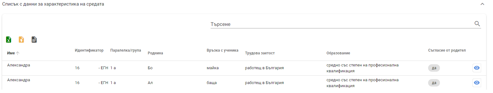

Това е списък с въведената в ЛОД на децата и учениците информация за характеристиката на средата.

С натискане на бутон "око", се зарежда раздел "Характеристика на средата" от ЛОД на детето/ученика в НЕИСПУО.

## Отписани деца/ученици без подписано ЛОД

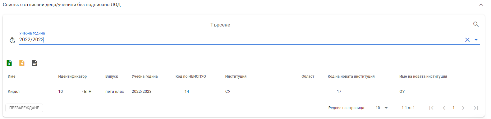

 Това е списък с деца/ученици, напуснали институцията, чиито ЛОД не са подписани (приключени). Списъкът е приложим за отписани лица - през цялата учебна година и за всички -
след приключване на учебните занятия. **Деца/ученици, преместени в учебно време, се визуализират в този списък, но за тях не следва да се предприемат действия!**

В случай че дете/ученик фигурира в списъка, институцията трябва да го запише отново, **без да го разпределя в клас**, от меню "Приключване на ЛОД"
в ЛОД да подпише ЛОД и да отпише лицето. Ако детето/ученикът вече е записан в друга институция, трябва или последната да одобри искане записване, подадено от 
изпращащата институция, или да отпише лицето.

## Права за достъп до ЛОД
Достъп до всчики деца/ученици и техните лични образователни дела притежава директора на институцията (с институционалния и личния профил от edu.mon.bg), както и потребители, на които е делегиран
директорски достъп от модул "Потребители" на НЕИСПУО.
Класните ръководители имат достъп до данните на децата/учениците от групите/класовете, на които те са класни ръководители.
За училищата класен ръководител е онзи преподавател, на който е възложен учебния предмет "Час на класа" с код на предмета 199.
За детските градини и предучилищните групи в училищата "класен ръководител" е онзи преподавател, на който е възложено образователно направление "Български език и литература" с код 80.

### "Класен" на служебната паралелка
Лице, което освен директора има достъп до ЛОД на учениците от служебната паралелка, може да се посочи по следния начин.
От меню "Профил" изберете "Настройки на приложението".

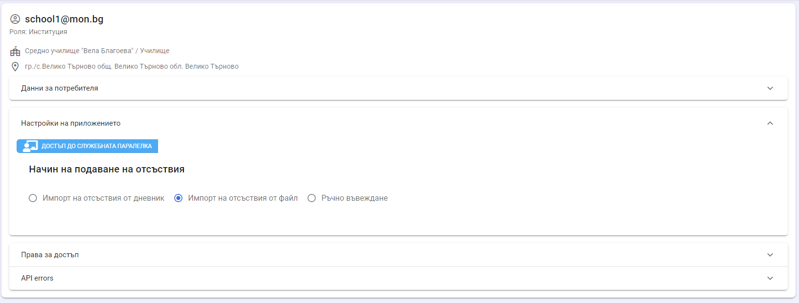

Натиснете бутон **Достъп до служебната паралелка** и след това бутон **Редакция**.

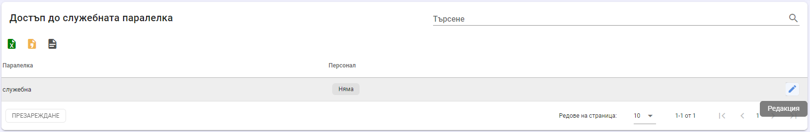

В полето "Персонал" въведете няколко букви от името или фамилията на преподавателя, на когото желаете да дадете достъп до учениците в служебната паралелка.

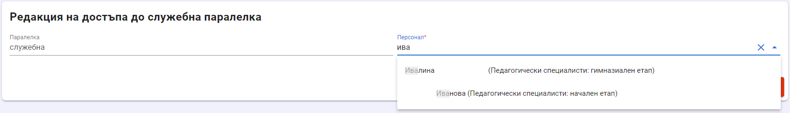

Изберете преподавател и запишете данните. Последната стъпка е избраният преподавател да излезе от НЕИСПУО и да влезе отново.
