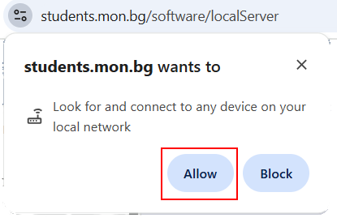
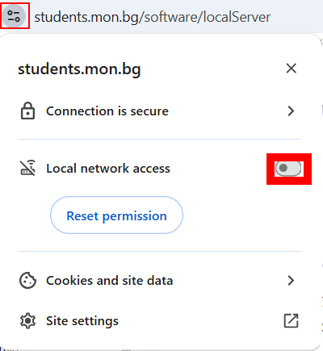
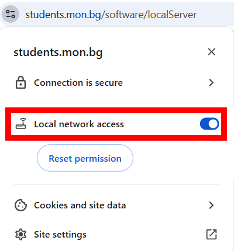

# Разрешаване на проблеми

## Проблем: Локалният сървър е инсталиран, но при опит за подписване възниква грешка "Локалният сървър не е намерен. Моля, уверете се, че е инсталиран и стартиран".

Ако локалният сървър е инсталиран, но операцията за подписване не може да се извърши, е възможно браузърът да е блокирал достъпа до локалната мрежа (Local Network Access) за страницата, която извършва комуникацията с локалния сървър. По-долу са описани препоръчани стъпки за диагностика и отстраняване на проблема.

### 1. Потвърждаване на първоначалния диалог за разрешение
При първоначален опит за връзка с локалния сървър браузърът може да покаже диалог за разрешение с подобно съобщение:

За да позволите комуникация със сървъра, изберете бутона **Allow**. След това презаредете страницата и повторете опита за подписване.

### 2. Ако достъпът вече е блокиран
Ако сте блокирали достъпа при предишен опит, отворете контролите за сайта, като натиснете иконата вляво от адресната лента (обикновено катинар или икона на сайт). Ще видите, че достъпът до локалната мрежа е маркиран като блокиран:

За да възстановите достъпа, включете опцията **Local Network Access**:

След промяната презаредете страницата и повторете операцията за подписване.

Ако грешката продължава да се показва, моля създайте заявка в системата за поддръжка на НЕИСПУО.