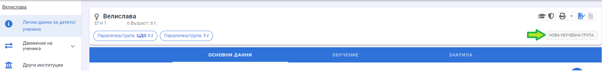
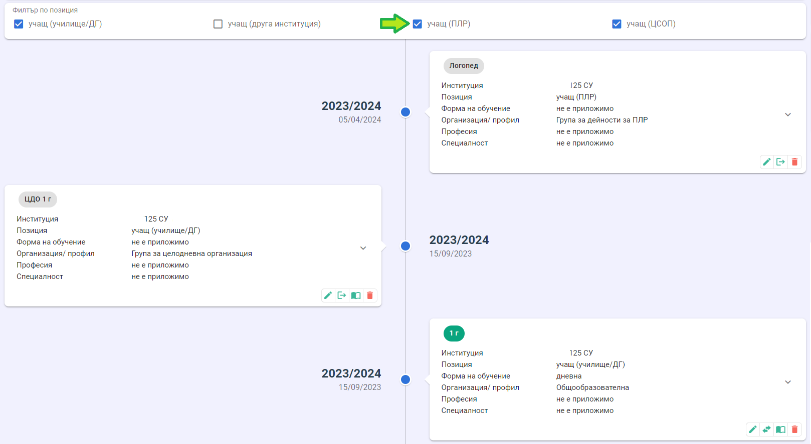
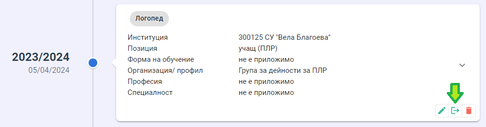

# Записване в неучебни групи
За да запишете дете/ученик в неучебна група, първо трябва да го запишете в институцията с документ за записване.
След създаване на документа за записване (и разпределяне в паралелка/група) можете да запишета детето/ученика в неучебна група от бутон **Нова неучебна група**.

Изберете група от падащото меню, въведете дата на записване и запишете данните.

<!--  -->

Всички записи на дете/ученик в паралелки и групи могат да бъдат разгледани в хронологията на детето/ученика (т.нар. timeline). Тя се достъпва от профила в НЕИСПО, бутон **Паралелки/групи**. Позицията на учениците, записани в група за целодневна организация, е "учащ (училище/ДГ)". Позицията на учениците, записани в групи за ПЛР, общежитие и други неучебни групи, е "учащ (ПЛР)".
Ако в хронологията на дете/ученик не се визуализират неучебните групи, то не е избран филтър по позиция "учащ (ПЛР)".

:::warning
При записване на дете/ученик в група за ресурсно подпомагане се извършва проверка за броя на децата/учениците в групата - той не може да надвишава дванадесет, освен ако за групата не е отбелязано (в модул "Институции"), че е изключение от чл. 109 от Наредбата за приобщаващото образование.
:::
## Редакция на записване в неучебна група
Данните за записване в паралелка/група могат да бъдат редактирани от бутон **Редакция**. Може да се редактира всяка група. При редакцията може да се променя датата на записване и групата. При редакция на групата няма да остане информация за предишното състояние на записа. Например - ако дете е било записано в група на лодопеда и след това се редактира и се избере група на психолога, то в хронологията няма да се визуализира записването в групата на логопеда. Т.е. редакцията може да се използва за корекция на техническа грешка.

## Преместване в друга неучебна група
За разлика от преместването на дете/ученик от една група/паралелка в груга в рамките на институцията, преместването от една **неучебна** група в друга (например от една група за ЦДО в друга) се извършва в две стъпки - отписване на детето/ученика от едната група и записване в другата. Отписването се извършва от бутон **Отписване**.

## Учебен план
**Приложимо е само за групи за целодневна организация!**
При записване в група за ЦДО ученикът автоматично се добавя в списъка на учениците по учебни предмети, които са маркирани, че се изучават от цялата група. Това не важи в случай че институцията използва външно приложение за подготовка на Списък-образец. В учебния план може да се влезе от бутон **Учебен план**.

Активен учебен предмет означава, че предметът е създаден в модул "Институции" и не е изтрит. Ако има ученици в списъка на неактивен учебен предмет, то при проверка на Списък-образеца в модул "Институции" се сигнализира валидационна грешка с код 53. Тя се отстранява, когато неактивният учебен предмет се премахне от учебния план на ученика.

За да добавите предмети в учебния план, поставете отметка пред наименованието на предметите и натиснете бутон **Добави избраните**. За да премахнете учебни предмети от учебния план, поставете отметка пред наименованието на предметите и натиснете бутон **Премахни избраните**.

## Изтриване на запис в група
От бутон **Изтриване** можете да изтриете записа за детето/ученика в групата. Този бутон следва да се използва **САМО** за корекция на технически грешки или при подготовката на Списък-образеца в началото на учебната година, когато се уточнява състава на групата. **Не използвайте този бутон за отписване на дете/ученик от групата!** При създаване на документ за отписване или преместване от институцията, детето/ученикът ще бъде премахнат и от групата.
