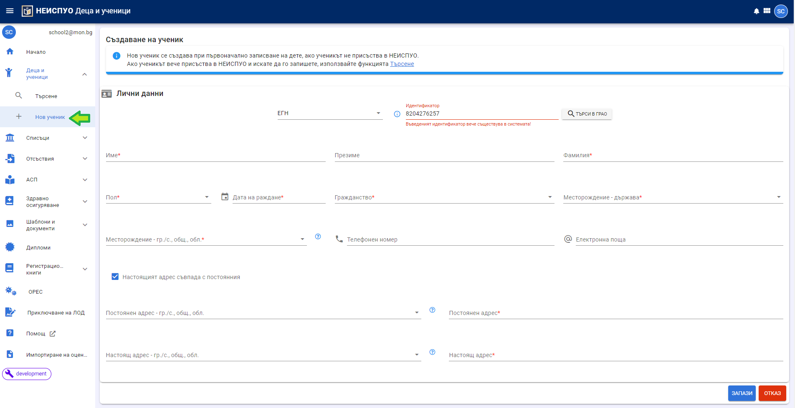
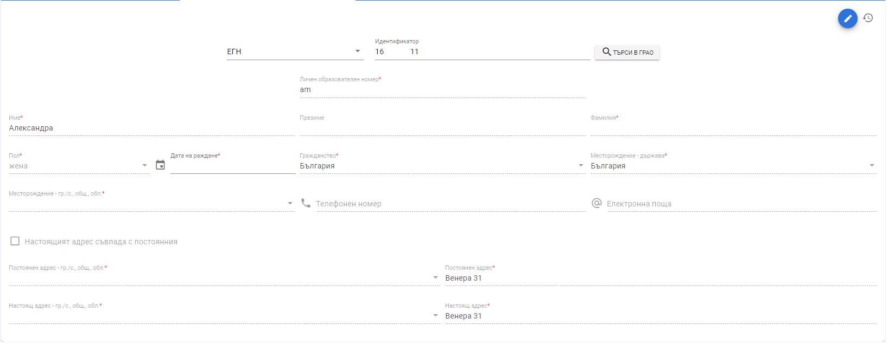

# Създаване на ново дете/ученик

От меню **Нов ученик** в НЕИСПУО се създава ново лице.

-   Вид на идентификатора - изберете **ИДН**, само и единствено ако лицето няма ЕГН или ЛНЧ. **Не използвайте тази опция, ако желаете да създадете в НЕИСПУО ново лице
лице и системата изведе съобщение, че въведеният идентификатор вече съществува в системата!**

-   Пол и дата на раждане - ако идентификаторът е ЕГН, тези данни се изчисляват автоматично от системата.

-   Гражданство - падащ списък с възможност за избор от предефинирани
    номенклатури;

-   Месторождение - гр./с., общ., обл. - падащ списък с възможност за избор
    от предефинирани номенклатури. **Ако в полето "Месторождение - държава" е избрана чужда държава, в поле "Месторождение"
    може да се въвежда свободен текст.**

-   Ако постоянният адрес съвпада с настоящия, сложете отметка на "Постоянният адрес съвпада с настоящия".

При натискане на бутон "ТЪРСИ В ГРАО", автоматично ще бъде попълнена информация, която ГРАО предоставя за лицата. **Не всички задължителни данни се
предоставят от ГРАО! Липсващите трябва да се попълнят ръчно. В противен случай системата сигнализира за валидационна грешка.**

# Редакция на паспортни данни за дете/ученик

Можете да редактирате паспортни данни за дете/ученик, когато той е записан във Вашата институция (не е необходимо да е разпределен в паралелка/група).

Натиснете бутон "молив". С това ще отключите данните за редакция.
