# Учебен план/програмна система

При записване или преместване в паралелка/група детето/ученикът автоматично се добавя в списъка на децата/учениците по учебни предмети, които са маркирани, че се изучават от целия клас/група. **Това не важи в случай че институцията използва външно приложение за подготовка на Списък-образец**. В учебния план може да се влезе от бутон **Учебен план**.

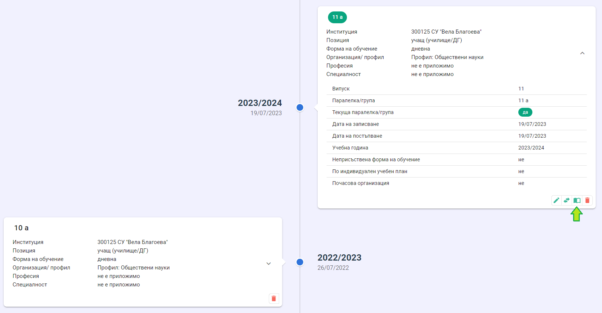

При натискане на бутона **Учебен план** се визуализира списък на учебните предмети, които се изучават от паралелката/групата, в която ученикът е записан.

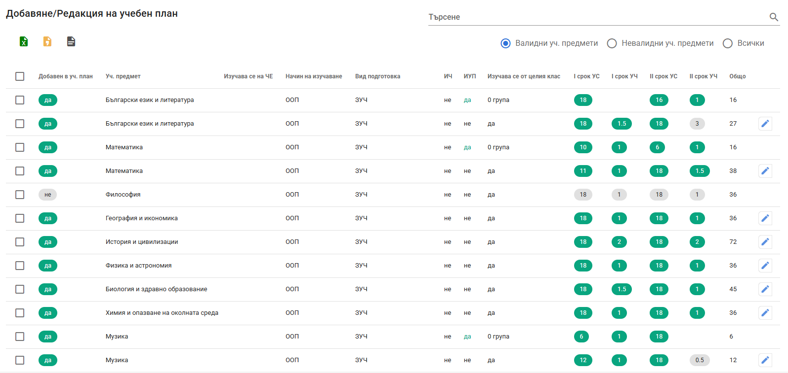
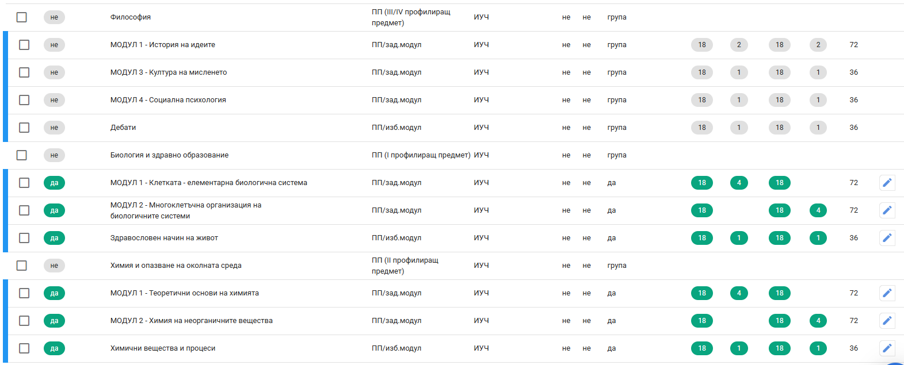

В горния десен ъгъл на страницата има възможност за филтриране на учебнтие предмети, които да се заредят в списъка, като:
- валиден учебен предмет означава, че предметът е създаден в модул "Институции" и не е изтрит
- невалиден учебен предмет е предмет, който е бил създаден в модул "Институции" и след това е бил изтрит. Ако има ученици, изучаващи неактивен учебен предмет, то при проверка на Списък-образеца в модул "Институции" се сигнализира валидационна грешка с код 53. Тя се отстранява, като неактивният учебен предмет се премахне от учебния план на ученика.
Същото важи за образователните направления в програмната система на децата.

В списъка с учебните премети се визуализира следната информация:
- **Добавен в уч. план** - "ДА" означава, че предметът е добавен в учебния план на паралелката/групата и ученикът е включен в списъка на изучаващите учебния предмет. Това е аналогично на следното в модул "Институции"

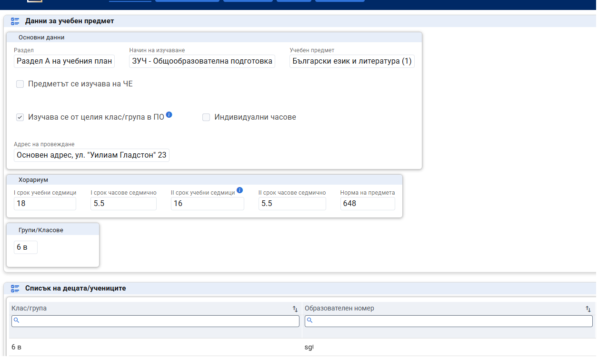

"НЕ" означава, че предметът е добавен в учебния план на паралелката/групата, но ученикът е включен в списъка на изучаващите учебния предмет.

- **ИЧ** - индивидуален час. Тук се отразява дали учебният предмет е отбелязан като "Индивидуални часове" в модул "Институции".

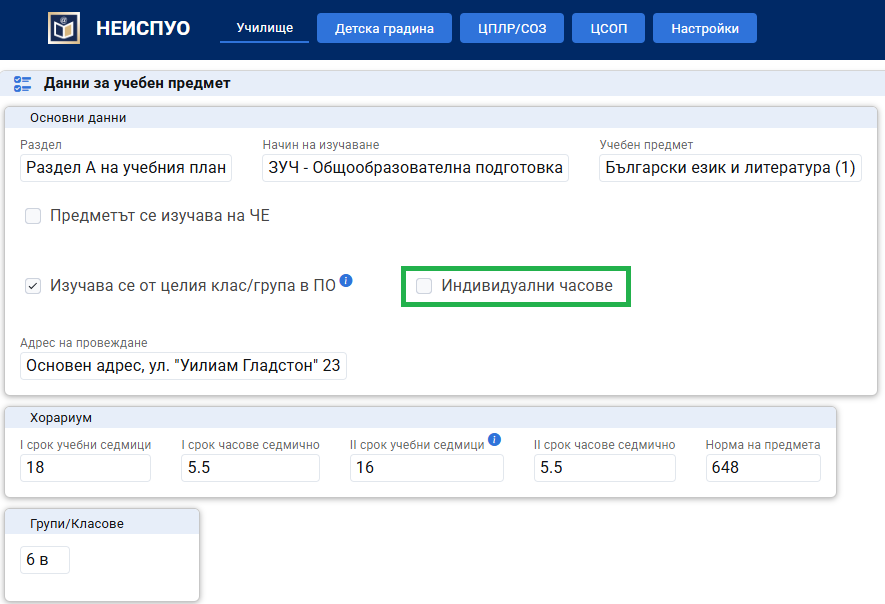

- **ИУП** - тук се показва информация дали предметът е от индивидуален учебен план, което е аналогично на следното от модул "Институции":

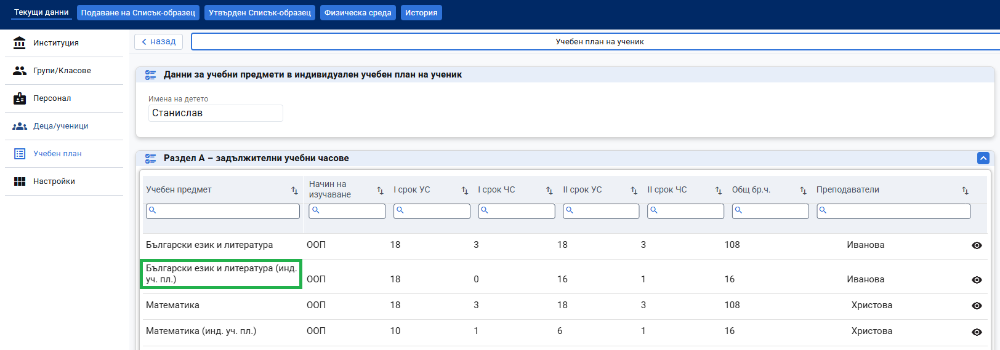
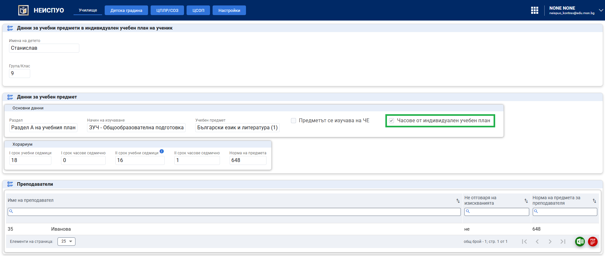

- **Изучава се от целия клас** - отразява флага, който се поставя в модул "Институции" и указва дали предметът се изучава от целия клас.

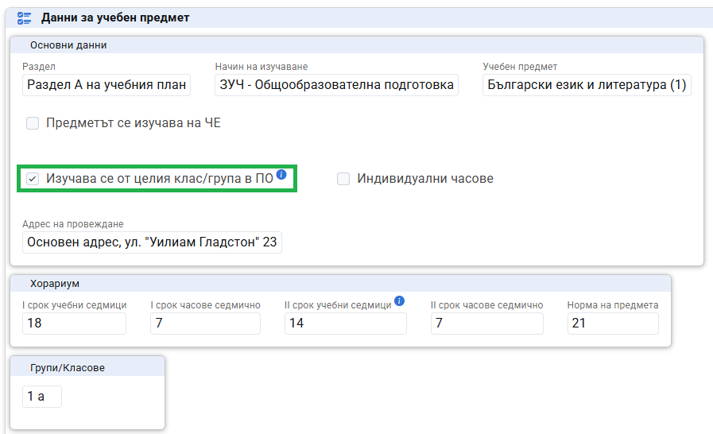

- **Хорариум**

Визуализира се хорариумът на ученика за учебния предмет с брой седмици и часове за първи и втори срок.

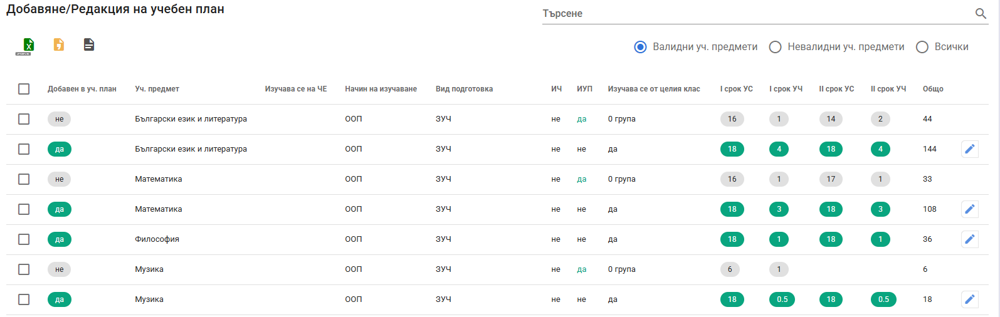

Хорариумът за учебния предмет за конкретния ученик може да се променя с помощта на бутона за редакция, разположен вдясно на реда. 

За да добавите ученика в списъка на изучаващите учебния предмет, поставете отметка пред наименованието на предмета (един или повече) и натиснете бутон **Добави избраните**.

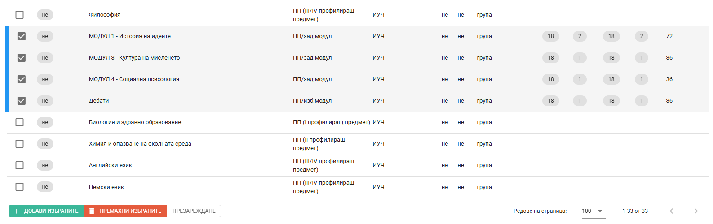

За да премахнете учебни предмети от учебния план на ученика, поставете отметка пред наименованието на предметите и натиснете бутон **Премахни избраните**.

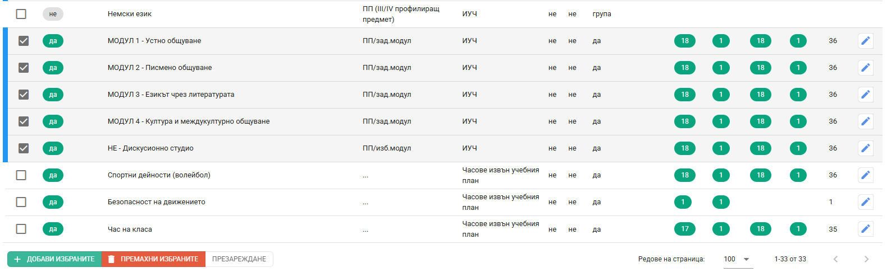

## Хорариум по учебни планове на ученици в индивидуална и комбинирана форма на обучение

Разделът описва стъпките за въвеждане на индивидуални учебни планове/хорариум на ученици в комбинирана форма на обучение (с редукция на хорариум) и на ученици в индивидуална форма на обучение.

За ученици в индивидуална или комбинирана форма на обучение (те би следвало да имат утвърден индивидуален учебен план) в модул **"Деца и ученици"**, данни за записване в паралелката трябва да е поставена отметката **"Индивидуален учебен план"**

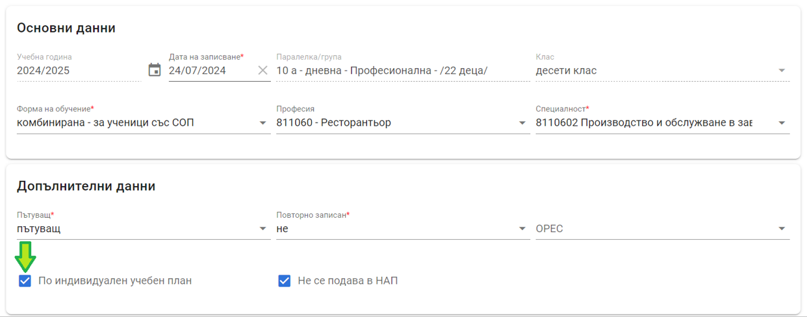

В модул **“Институции”**, меню **“Учебен план”**, раздел **“Индивидуални учебни планове”** се описват всчики учебни предмети, които се изучават индивидуално, т.е. ученикът **не влиза в часа с целия клас** и преподавателят по учебния предмет се занимава с ученика извън часовете с класа.

В модул **“Институции”**, меню **“Учебен план”**, ученикът се включва в списъка на учебните предмети, по които влиза в час с целия клас, независимо че хорариумът е **РЕДУЦИРАН**. 

:::warning
Редукцията на хорариума се отразява в модул **“Деца и ученици”**.
:::

Редукцията се прави тук:

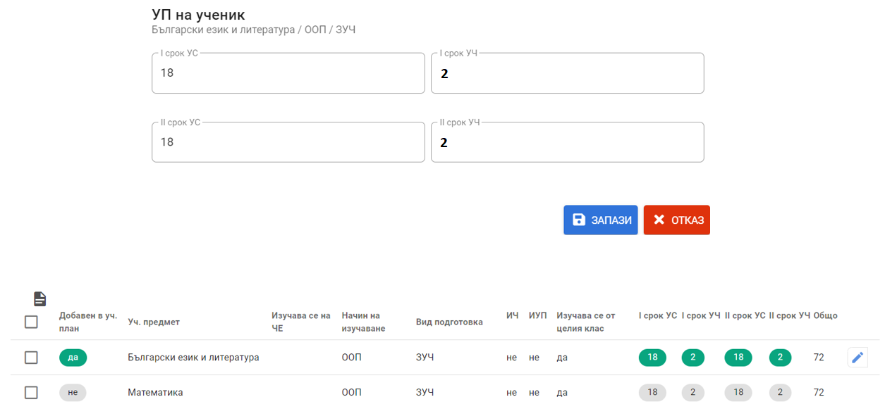

Следва описание на конкретните стъпки, които следва да се извършат в НЕИСПУО при най-чесо срещаните случаи на промяна на формата на обучение на учениците.

### Пример 1: Ученик с индивидуален учебен план в индивидуална форма на обучение от началото на учебната година

В този случай ученикът не посещава учебни часове заедно с класа, а преподавател/преподаватели го обучават индивидуално, извън часовете с класа.
1. В модул **"Деца и ученици"**, данни за записване в паралелката поставете отметката **"Индивидуален учебен план"**.
2. В модул **“Институции”**, меню **“Учебен план”**, раздел **“Индивидуални учебни планове”** се описват всчики учебни предмети от индивидуалния учебен план със съответния хорариум и преподаватели.

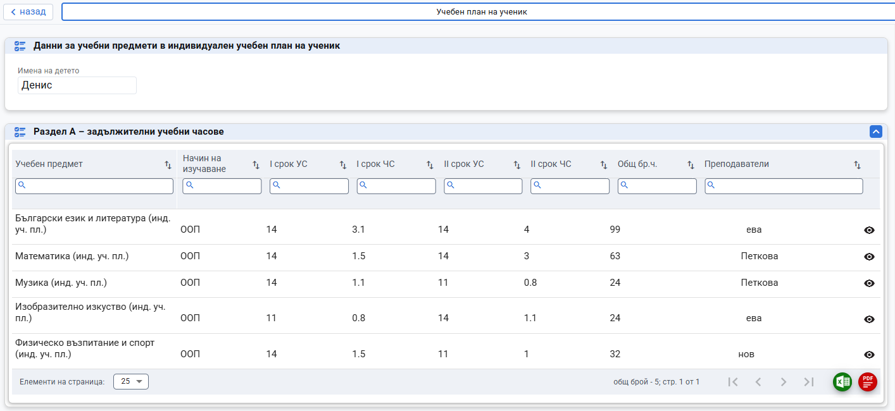

### Пример 2: Ученик в девети клас с индивидуален учебен план е в комбинирана форма на обучение от началото на учебната година

В началото на учебната година се утвърждава индивидуален учебен план за цялата година за ученик в комбинирана форма на обучение, например:
- Български език и литература (БЕЛ)/ООП: 1.5 часа седмично - с класа (хорариумът на класа е 3 часа седмично) и 1 час седмично - самостоятелно с преподавател по БЕЛ
- Математика/ООП: 1 час седмично - с класа (хорариумът на класа е 3 часа седмично) и 1 час седмично - самостоятелно с преподавател по математика
- Биология и здравно образование/ООП: 1 час седмично - самостоятелно с преподавател по Биология и здравно образование
- Музика/ООП: 1 час седмично с класа (хорариумът на класа е 1 час седмично)

В модул **"Деца и ученици"**, данни за записване в паралелката поставете отметката **"Индивидуален учебен план"**.

1. ***По отношение на БЕЛ***

1.1. В модул **"Институции"** ученикът се добавя в списъка на класа по учебния предмет БЕЛ, който се изучава от целия клас.

1.2. В модул **"Деца и ученици"** се прави редукция на часовете за конкретния ученик по БЕЛ (за конкретния пример - 18/3 за първи срок се променя на **18/1.5** и 18/3 за втори срок се променя на **18/1.5**).

1.3. В модул **“Институции”**, меню **“Учебен план”**, раздел **“Индивидуални учебни планове”** се създава нов учебен предмет - "БЕЛ" и се задава хорариум 18/1 за първи срок и 18/1 за втори срок.

2. ***По отношение на Математика***

2.1. В модул **"Институции"** ученикът се добавя в списъка на класа по учебния предмет Математика, който се изучава от целия клас.

2.2. В модул **"Деца и ученици"** се прави редукция на часовете за конкретния ученик по Математика (за конкретния пример - 18/3 за първи срок се променя на **18/1** и 18/3 за втори срок се променя на **18/1**).

2.3. В модул **“Институции”**, меню **“Учебен план”**, раздел **“Индивидуални учебни планове”** се създава нов учебен предмет - "Математика" и се задава хорариум 18/1 за първи срок и 18/1 за втори срок.

3. ***По отношение на Биология и здравно образование***

3.1. В модул **“Институции”**, меню **“Учебен план”**, раздел **“Индивидуални учебни планове”** се създава нов учебен предмет - "Биология и дравно образование" и се задава хорариум 18/1 за първи срок и 18/1 за втори срок.

4. ***По отношение на Музика***

4.1. В модул **"Институции"** ученикът се добавя в списъка на класа по учебния предмет Музика, който се изучава от целия клас.

:::info
Нормата на предмета и нормата на предмета за преподавателя за часовете от индивидуалния учебен план се залагат съгласно нормативната уредба.
:::

### Пример 3: Ученик в девети клас, започнал обучението си в дневна форма на обучение, преминава в индивидуална форма на обучение с индивидуален учебен план след 12-та седмица от учебната година

Утвърждава се индивидуален учебен план за ученика след дванадесетата седмица на учебната година, например:
- Български език и литература (БЕЛ)/ООП: 1 час седмично - самостоятелно с преподавател по БЕЛ. До дванадесетата седмица на учебната година ученикът е бил в дневна форма на обучение и е посещавал часовете по БЕЛ с целия клас.
- Музика: спира да се изучава след дванадесетата седмица от учебната година.

В модул **"Деца и ученици"**, данни за записване в паралелката поставете отметката **"Индивидуален учебен план"**.

1. ***По отношение на БЕЛ***

1.1. В модул **"Институции"** ученикът се оставя в списъка на класа по учебния предмет БЕЛ, който се изучава от целия клас.

1.2. В модул **"Деца и ученици"** се прави редукция/корекция на часовете за конкретния ученик по БЕЛ (за конкретния пример - 18/3 за първи срок се променя на **12/3** и 18/3 за втори срок се променя на **18/0**, в брой часове за II срок се натиска бутона **Х**)

1.3. В модул **“Институции”**, меню **“Учебен план”**, раздел **“Индивидуални учебни планове”** се създава нов учебен предмет - "БЕЛ" и се задава хорариум **6/1** за първи срок и **18/1** за втори срок.

2. ***По отношение на Музика***

2.1. В модул **"Институции"** ученикът се оставя в списъка на класа по учебния предмет Музика, който се изучава от целия клас.

2.2. В модул **"Деца и ученици"** се прави редукция/корекция на часовете за конкретния ученик по Музика (за конкретния пример - 18/3 за първи срок се променя на **12/1** и 18/1 за втори срок се променя на **18/0**, в брой часове за II срок се натиска бутона **Х**)

:::info
Нормата на предмета и нормата на предмета за преподавателя за часовете от индивидуалния учебен план се залагат съгласно нормативната уредба.
:::
