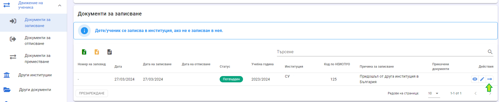
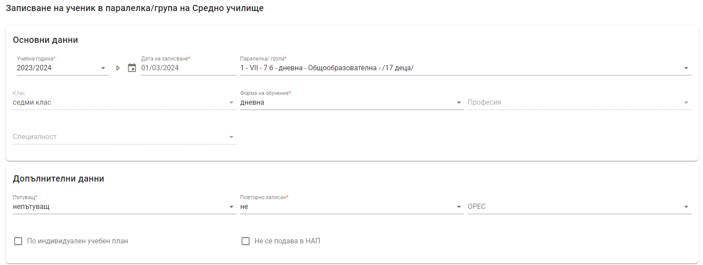
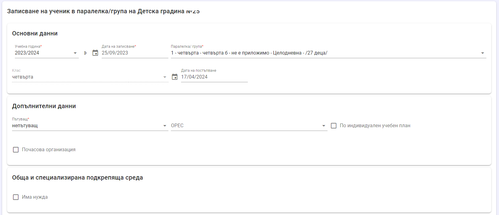
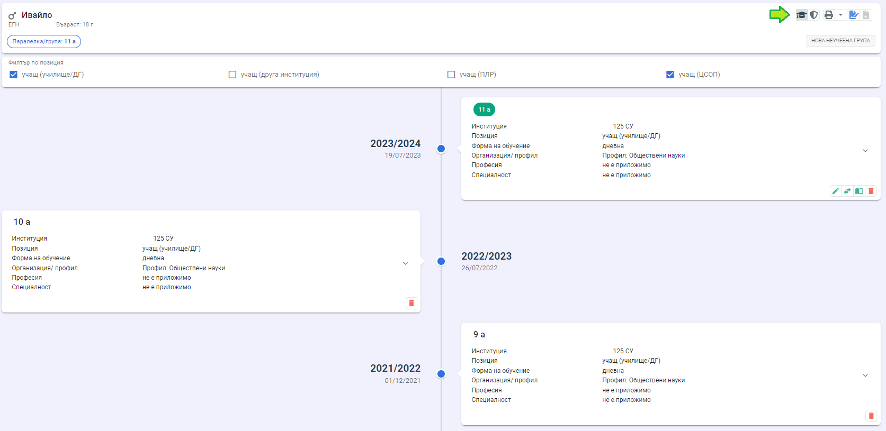
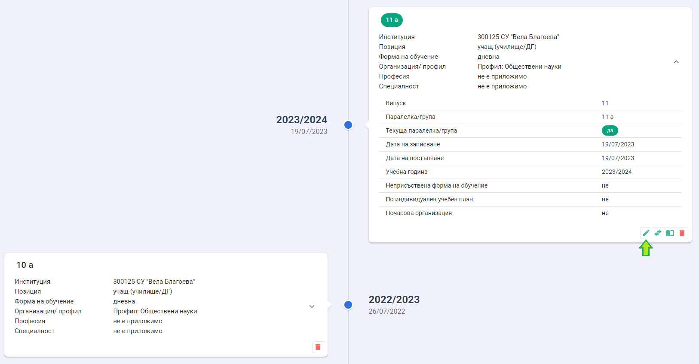
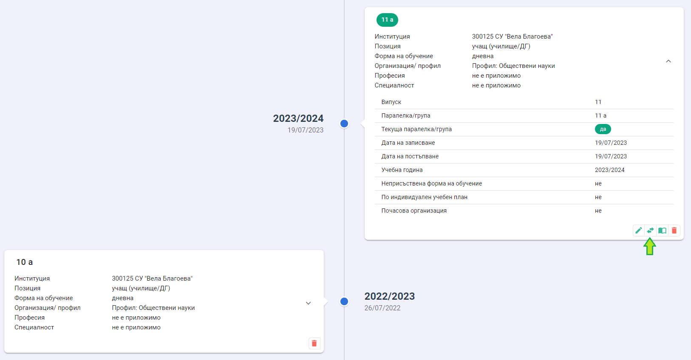
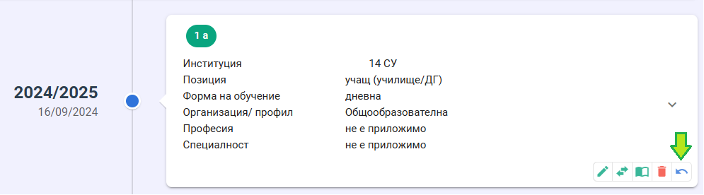

# Записване в паралелки и групи

## Записване в паралелка/група в ДГ
За да запишете дете/ученик в паралелка/група, първо трябва да го запишете в институцията с документ за записване.
След създаване на документа за записване можете да разпределите детето/ученика в паралелка/група в ДГ от бутон **Записване в паралелка/група**.

**За паралелки**
При избор на паралелка автоматично се попълват данните от характеристиките на самата паралелка. Випускът не може да се променя, но формата на обучение и специалността могат да бъдат променяни в зависимост от конкретния ученик.

В падащото меню за избор на паралелка се визуализират следните данни:
- Номер - ако паралелката е разделена на групи;
- Випуск;
- Наименование;
- Вид на паралелката - общообразователна, профилирана, професионална и т.н.;
- Брой деца в паралелката.

**За предучилищни групи**
При избор на група автоматично се попълват данните от характеристиките на самата група. Възрастовата група не може да се променя.

В падащото меню за избор на група се визуализират следните данни:
- Номер - ако групата е разновъзрастова и е разделена на подгрупи;
- Възрастова група;
- Наименование;
- Организация на учебния процес;
- Брой деца в групата/подгрупата.

След записване в паралелка/група, бутонът **Записване в паралелка/група** в списъка с документите за записване изчезва, т.е. един документ за записване може да се използва за точно едно записване в паралелка/група.
При запис на данните детето/ученикът вече е разпределен в паралелка/група и ще се покаже в електронния дневник.

Всички записи на дете/ученик в паралелки и групи могат да бъдат разгледани в хронологията на детето/ученика (т.нар. timeline). Тя се достъпва от профила в НЕИСПО, бутон **Паралелки/групи**.

:::danger
Отметките в горната част на страницата служат само за филтриране на данните в хронологията. **Това не е индикация, че детето/ученикът за записано в друга институция или ЦСОП!**
- при маркирано "учащ (училище/ДГ)" в хронологията ще се покажат всички паралелки и групи, в които детето/ученикът е бил записван с тази позиция;
- при маркирано "учащ (друга институция)" в хронологията ще се покажат всички паралелки и групи, в които детето/ученикът е бил записван с тази позиция;
- при маркирано "учащ (ПЛР)" в хронологията ще се покажат всички паралелки и групи, в които детето/ученикът е бил записван с тази позиция;
- при маркирано "учащ (ЦСОП)" в хронологията ще се покажат всички паралелки и групи, в които детето/ученикът е бил записван с тази позиция;
:::
## Редакция на записване в паралелка/група

Данните за записване в паралелка/група могат да бъдат редактирани от бутон **Редакция**. Може да се редактира само текущата паралелка/група.

Чрез редакция на записа в паралелката се извършва
- промяна на формата на обучение;
- преминаването на ученик на индивидуален учебен план;
- преминаването на дете на почасова огранизация
За дата, от която влиза в сила промяната, се счита датата, на която данните са променени в НЕИСПУО.

:::danger
Преминаване на дете/ученик в **самостоятелна форма на обучение** се извършва чрез преместване в служебната паралелка.
:::

## Преместване в друга паралелка/група
Преместването на дете/ученик от една група/паралелка в груга в рамките на институцията се извършва от бутон **Преместване в друга паралелка/група**

От падащото меню изберете новата паралелка/група и дата на записване. Избраната дата на записване ще се счита и за дата на отписване от предишната паралелка/група.

## Промяна на позиция

Дадена е възможност за промяна на позиция на дете/ученик от бутон **Смяна на позиция**.

Достъпна е за училища и ДГ и се използва се в следните случаи:
- за промяна на позиция от "учащ (училище/ДГ)" на "учащ (ЦСОП)" - ученикът трябва да е записан в ЦСОП, за да е възможна промяната
- за промяна на позиция от "учащ (ЦСОП)" на "учащ (училище/ДГ)" - ученикът трябва да е отписан от ЦСОП, за да е възможна промяната