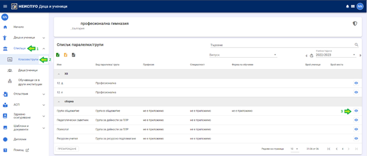
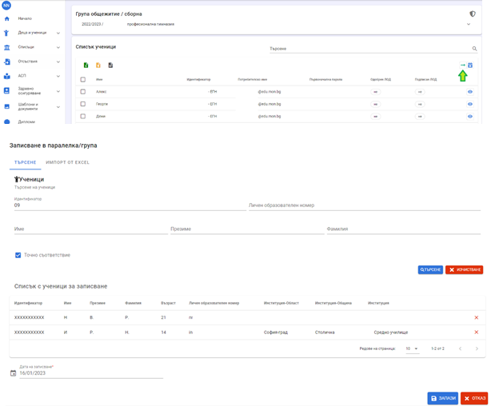

# Записване в неучебна група на друга институция/ЦПЛР
Тук е описана функционалностите на модул „Деца и ученици“ на НЕИСПУО, с помощта на които се записват/отписват ученици в/от:
- групи в несамостоятелни общежития (напр. група в общежитие на училище);
- логопедични групи в друго училище/ДГ;
- групи за ресурсно подпомагане в друго училище/ДГ;
- групи за други дейности по ПЛР в друго училище/ДГ;
- групи в ЦПЛР (вкл. ЗОС и РЦПППО).

Сценарият се прилага в случаите, в които дете/ученик се обучава в едно училище/ДГ и трябва да бъде записан в:
- група в общежитие в друго училище или ЦСОП;
- логопедична група в друго училище/ДГ;
- група за ресурсно подпомагане в друго училище/ДГ;
- групи за други дейности по ПЛР в друго училище/ДГ;
- групи в ЦПЛР (вкл. СОЗ и РЦПППО).

:::info
**В тези случаи не е необходимо да се създава документ за записване в институцията!**
:::
От началния екран на модул „Деца и ученици“ изберете меню „Списъци“, подменю “Класове/групи“. Навигирайте до групата, в която трябва да запишете ученика и натиснете бутон **Детайли**.

За да запишете дете/ученик в групата, натиснете бутон **Записване в група**.

Въведете идентификатор (ЕГН/ЛНЧ/ИДН) на детето/ученика, който желаете да запишете в избраната група и натиснете бутон **Търсене**. Ако лицето съществува в НЕИСПУО, за него ще се появи нов ред в списъка с деца/ученици за записване. Ако лицето не съществува, ще се изведе съобщение за това. В такъв случай първо трябва да създадете нов ученик и след това да продължите със записването му в групата.

Дадена е възможност едновременно да бъдат записани повече от един ученик в избраната група. За да добавите втори ученик в списъка с ученици за записване, въведете неговия идентификатор и натиснете бутон „Търсене“. Можете да продължите с добавянето на други ученици в списъка. Можете да премахнете добавен в списъка ученик с помощта на бутон **Премахване**.

За да запишете учениците в групата, въведете дата на записване и натиснете бутон **Запази**.

:::warning
При записване на дете/ученик в група за ресурсно подпомагане се извършва проверка за броя на децата/учениците в групата - той не може да надвишава дванадесет, освен ако за групата не е отбелязано (в модул "Институции"), че е изключение от чл. 109 от Наредбата за приобщаващото образование.
:::

Съществува функционалност, с помощта на която може да се отписват ученици от групите (общежитие, логопедична и за ресурсно подпомагане), **без да е необходимо да се създава документ за отписване**. В списъка с ученици в групата изберете ученик/ученици, които желаете да отпишете от групата и натиснете бутон **Отписване на избраните**.

