# ЛОД
Модул "Деца и ученици" съдържа лични образователни дела на децата и учениците с информация,
описана в Приложение № 3 НАРЕДБА № 8 от 11.08.2016 г. за информацията и документите за системата на предучилищното и училищното образование

## Характеристика на средата
В този раздел на ЛОД се въвеждат и могат да бъдат прегледани данни за дете/ученик,
свързани с работна карта "Характеристика на средата". В допълнение, тук се попълват и следните данни:
- Дали детето/ученика се представлява от кмета на населеното място
- Дали ученикът e настанен в общежитие/център за настаняване от семеен тип/приемно семейство
- Език на семейната среда
- Информация за личен лекар

Всички полета са достъпни за попълване, ако е поставена отметката *"Родителите са дали съгласие да подадат информация"*.
Редакцията се извършва от бутон **Редакция**, разположен в горния десен ъгъл.

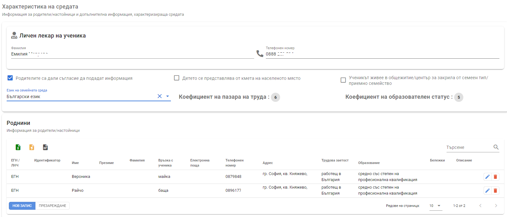

Чрез избор на бутон **Редакция** се отваря екран за въвеждане на данни
за характеристика на средата към профила на детето/ученика. Полетата стват достъпни за попълване при поставяне на
отметка при *"Родителите са дали съгласие да подадат информация"*

Бланката започва с данни за личния лекар на детето/ученика, като тук
може да се отбележи и:

- Дали детето/ученика се представлява от кмета на населеното място
- Дали ученикът e настанен в общежитие/център за настаняване от семеен тип/приемно семейство
- Езикът на семейната среда

Следващата част продължава с описание на роднините. Тук се виждат вече
въведените лица към детето/ученика. Въведените данни могат да бъдат редактирани от бутон **Редакция**, както и изтрити от бутон **Изтриване**.
От бутон **Нов запис** се зарежда бланка, в която е задължително да се въведе информация за връзката на роднината с детето/ученика,
образованието и трудовата заетост на лицето. Останалите данни не е задължително да бъдат въведени. Когато не се въвежда идентификатор (ЕГН/ЛНЧ) на 
роднината, се избира опцията *"Без идентификатор"*.

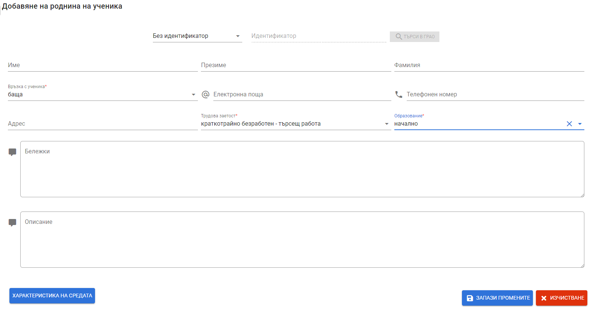

При въведени данни за роднините на детето/ученика системата автоматично изчислява коефициентите на пазара на труда и на образователния статус.

:::info
В случай че институцията използва външно приложение за подготовка на Списък-образец, данни за характеристика на
средата **не може** да се попълват в НЕИСПУО. Те се подават чрез синхронизация с външното приложение.
:::

## Общи данни за институцията
В този раздел на ЛОД се визуализира информация за институцията, в която детето/ученикът е записан. Източникът на данни е Регистър на институциите
и не могат да бъдат променяни от модул "Деца и ученици".

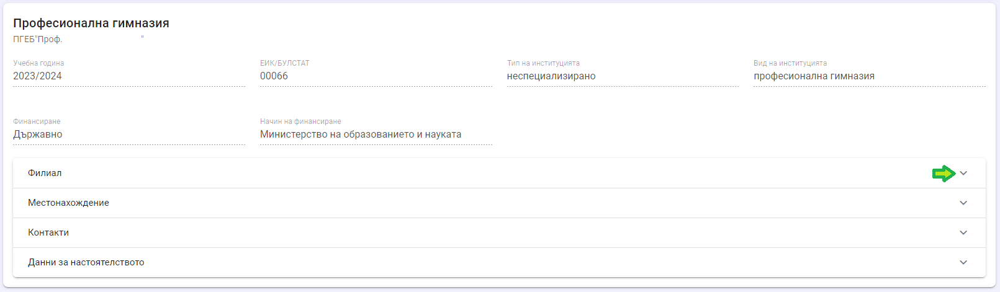

По-детайлна информация за институцията може да се види с натискане на бутоните със стрелките, разположени вдясно до менютата.

## Общи данни за обучението
В този раздел на ЛОД се визуализира информация за всички групи и паралелки, в които детето/ученикът е бил записван за целия му престой в системта на 
предучилищното и училищното образование, независимо от институцията. Данните са замо за оглед и не могат да бъдат променяни от този раздел на ЛОД.

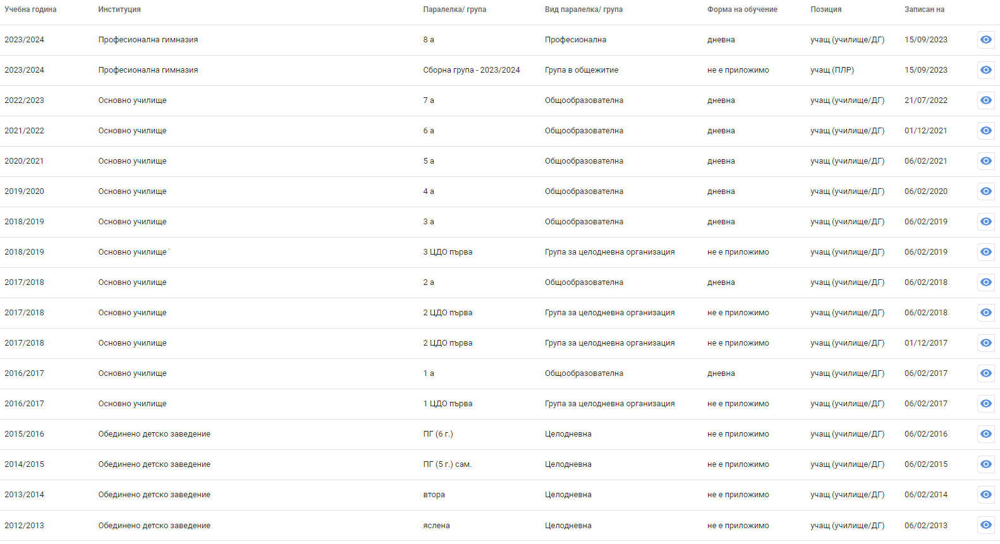

От бутон **Детайли** се зарежда подробна информация за паралелката/групата (форма на обучение, профил, професия, специалност), дати на записване и отписване,
данни за програмната система/учебния план на детето/ученика.

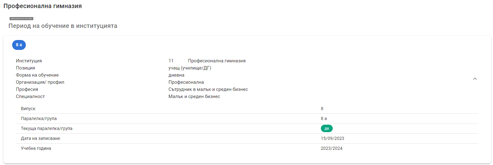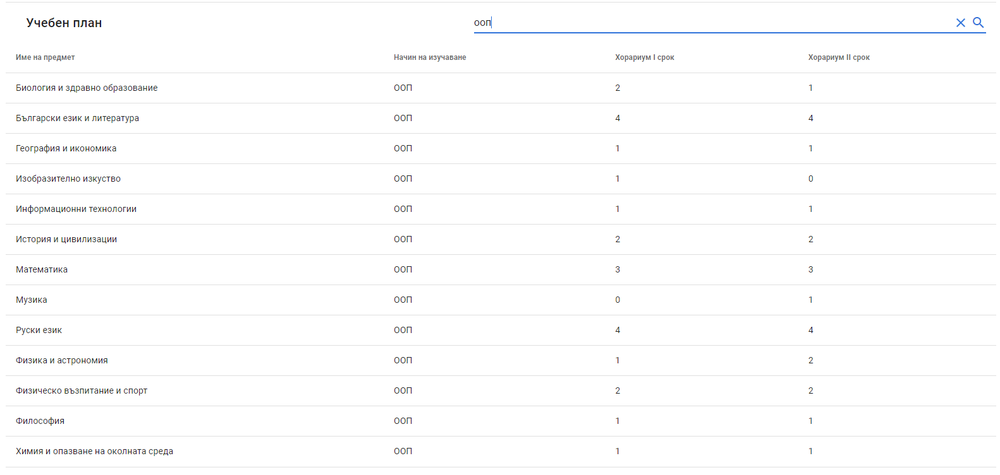

## Предучилищна подготовка
В този раздел на ЛОД се визуализира и въвежда информация за резултатите по образователни направления в предучилищното образование
в началото и в края на учебната година. При въвеждане на данни системата проследява възрастовата група на детето и позволява въвеждане на резулатати само за тази група.
Т.е. не е възможно въвеждане на резултати за трета група, ако детето е втора. Възможни са два начина за въвеждане на информация - ръчно в ЛОД или чрез импорт от дневника в ЛОД.

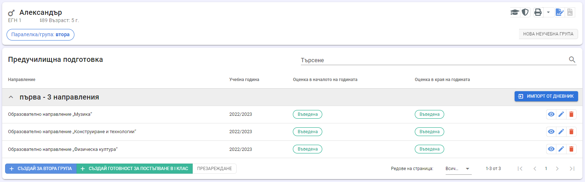

От бутон **Преглед** може да се разгледа въведената информация.

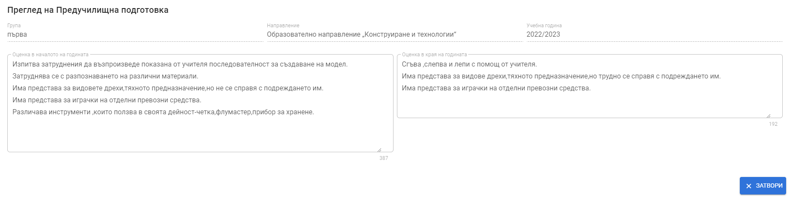

От бутон **Създай за ... група** се зареждат образователните направления в предучилищното образование, като е налична индикация дали има въведени данни за оценката
в началото и в края на учебната година.

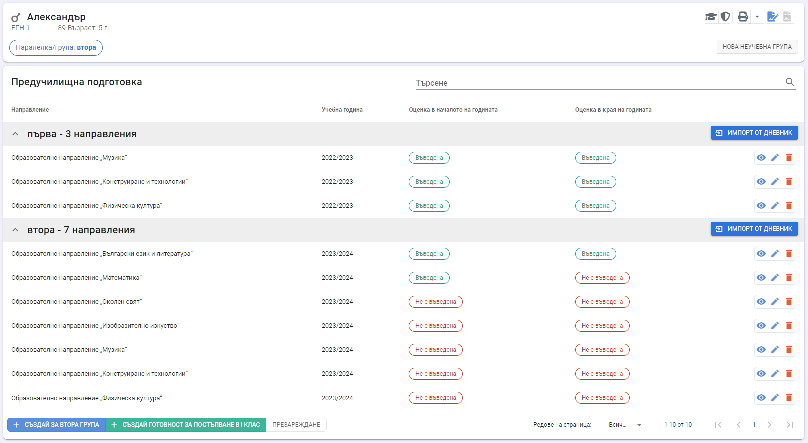

Ръчното въвеждане на информация за резултати по образователни направления става от бутон **Редакция**. От бутон **Импорт от дневник**
в ЛОД се зарежда информацията, която е вписана в дневника на групата за конкретното дете.
:::warning
Ако след импорт на данните от дневника се направи редакция, при повторно зареждане на резултатите от дневника направената промяна ще се загуби!
:::
:::info
Не е задължително данните от входящата диагностика да бъдат импортирани в ЛОД в началото на учебната година, но е задължително в края на годината в ЛОД
да има информация за резултатите и в началото, и в края на годината!
:::

**Готовност за постъпване в първи клас**

От бутон **Създай готовност за постъпване в I клас** системата автоматично генерира текст с въведените резултати в края на учебната година от последната група, в която е записано детето.
Текстът може да се редактира и допълва. Така изготвената информация за готовността за постъпване в I клас се използва при изготвяне на 3-19 Удостоверение за задължително предучилищно образование.

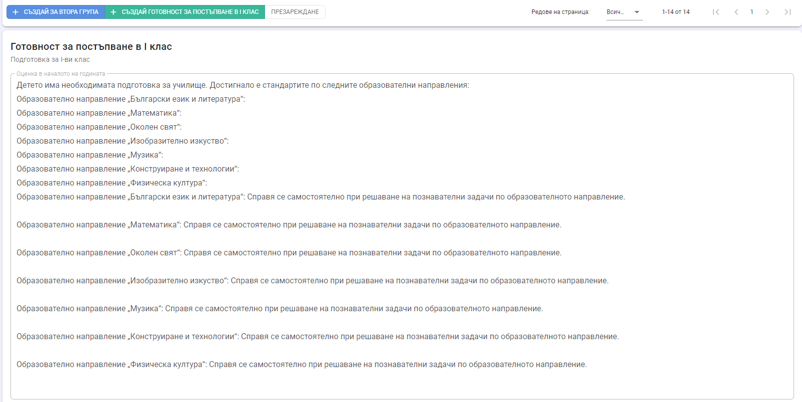

## Оценки
В този раздел на ЛОД се визуализират и попълват данни за резултатите от обучението на учениците по учебни предмети. Тук се визуализира информация за оценки, въведени в дневника и в разделите
"Признаване" и "Приравняване" на ЛОД. Има възможност и за ръчно въвеждане на срочни и годишни оценки.
За всяка учебна година и випуск се визуализира по един ред оценки, заредени от дневника, от приравнителни изпити или от признаване на резултати. Резултатите от тези източници не могат да се
променят в този раздел на ЛОД. **Ако се налага промяна, тя трябва да бъде направена в дневника или в другите раздели на ЛОД.**

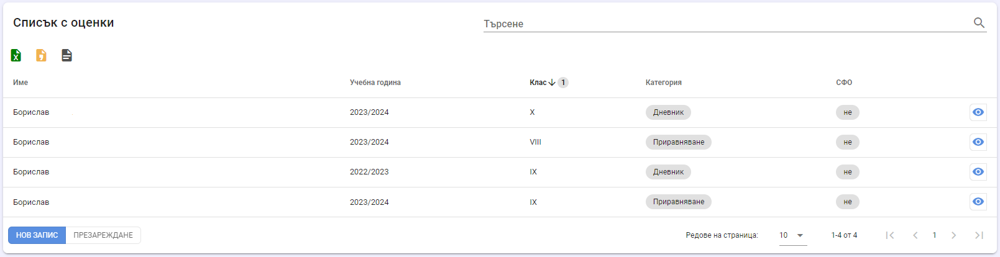

От бутон **Детайли** се зарежда екран със срочни и годишни оценки за избраната учебна година и випуск.

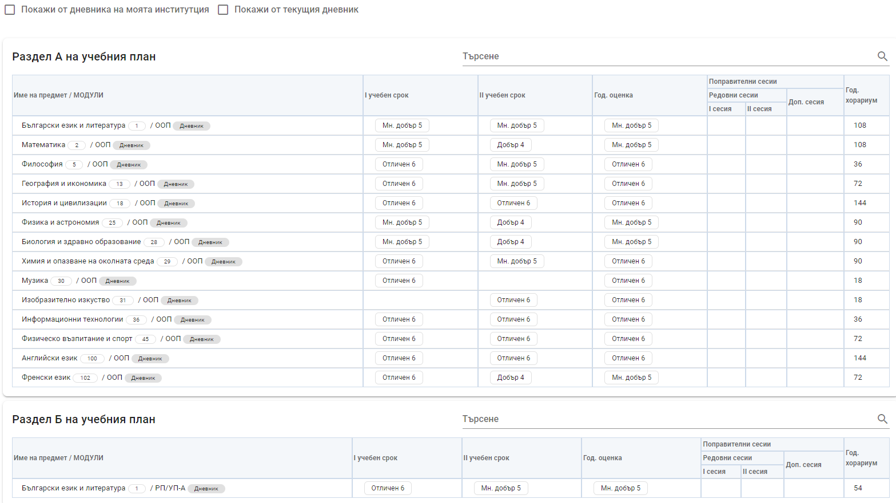

**Покажи от дневника на моята институция** - тази опция служи за филтриране на оценките в следната ситуация: ученик, преместен от една институция в друга след края на първия срок. В този случай той 
има срочни оценки за първия срок от изпращащата институция, но те се вписват и в дневника на приемащата институция. В този случай в ЛОД се получава дублиране на срочните оценки и чрез използване на 
опцията "Покажи от дневника на моята институция" срочните оценки от изпращащата институция не се визуализират.

**Покажи от текущия дневник** - тази опция служи за филтриране на оценките в следната ситуация: ученик, преместен от една паралелка в друга след края на първия срок. В този случай той 
има срочни оценки за първия срок в дневника на едната паралелка, но те се вписват и в дневника на другата. В този случай в ЛОД се получава дублиране на срочните оценки и чрез използване на 
опцията "Покажи от дневника на моята институция" срочните оценки от първата паралелка не се визуализират.

Възможно е да се визуализират учебни предмети без срочни и годишни оценки, например 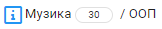
Това са учебни предмети, включени в учебния план на ученика, за които липсват срочни или годишна оценки в дневника.

Дадена е възможност и за ръчно въвеждане на резултати от обучението, които не фигурират нито в дневника, нито в разделите ЛОД "Приравняване" и "Признаване".
Това се извършва от бутон **Нов запис**, като първата стъпка е да се избере учебната година, за която се отнасят данните. Системата автоматично изчислява паралелките,
в които ученикът е записан или е бил записан и предоставя възможност за избор (ако са повече от една).

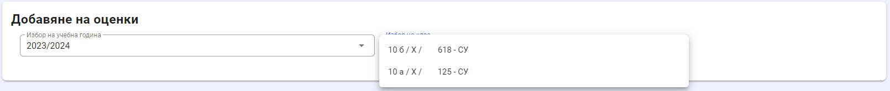

След избор на учебна година и клас има две възможности:
- от бутон **Зареждане на учебен план** да се заредят учебните предмети по раздели от учебния план на избранта паралелка и да се въведат ръчно срочните и годишните оценки:

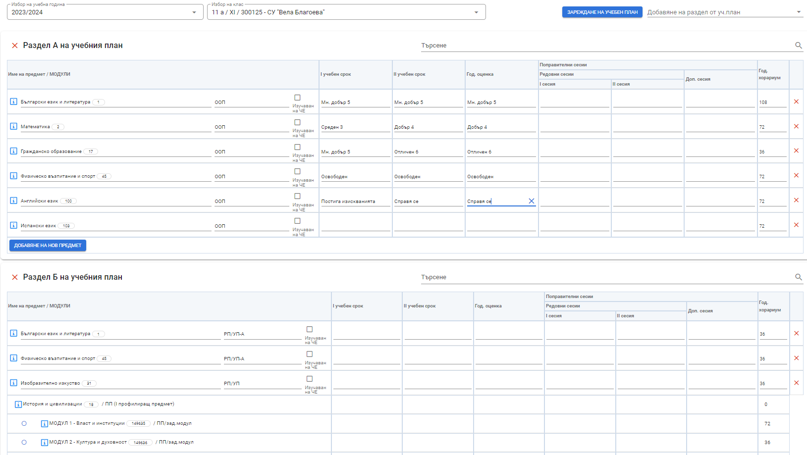

- от падащото меню да се избере раздел на учебния план и учебните предмети, както хорариума и оценките да се въведат ръчно (от бутон **Добавяне на нов предмет**):

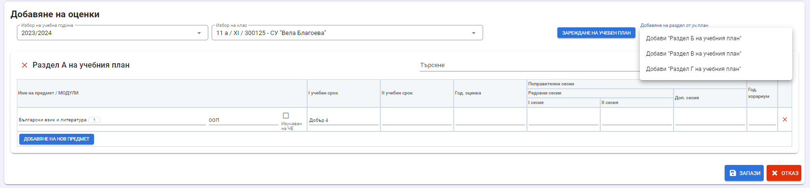

Възможността за ръчно добавяне на учебни предмети и оценки може да се използва в случаите, в които ученикът е изучавал предмет в друга институция и за този предмет липсват оценки в дневника.

:::info
Учебните предмети, които модат да се избират, са онези предмети, които са настроенни в модул "Институции", меню "Настройки", раздели "Задължителни предмети" и "Други предмети."

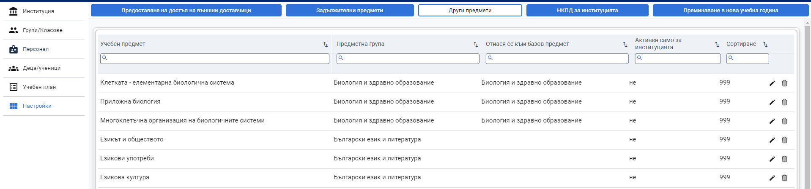
:::

:::warning
Ако бутоните за редакция и изтриване на данни в раздел "Оценки" са недостъпни, то ЛОД на ученика за учебната година е заключен (подписан). Бутоните ще станат доастъпни, ако отключите ЛОД.
:::

## Резултати от изпити, положени от ученици в неприсъствена форма на обучение

В раздела на ЛОД "Оценки" се въвеждат и резултатите от положените изпити от ученици в самостоятелна форма на обучение (СФО). Тези лица следва да са записани в служебната паралелка.
Има възможност за създаване на шаблони с учебни предмети за ученици в СФО. Шаблоните се създават и настройват от меню "Шаблони и документи" в началната страница, подменю "Шаблони за УП в СФО".

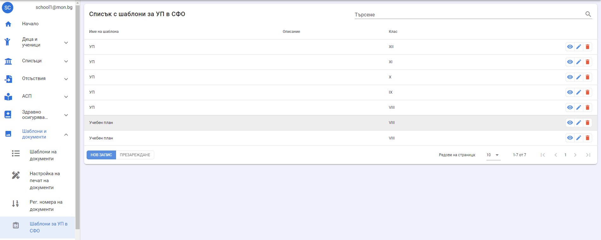

При създаване на нов шаблон задължително се попълва наименование на шаблона (свободен текст) и випуск (клас), за който ще се използва шаблонът. Следва добавяне на раздели от учебния план и
учебни предмети. Възможно е, но **не е задължително**, да се въведат и оценки, които при нанасяне на резултатите за конкретен ученик може да се променят.

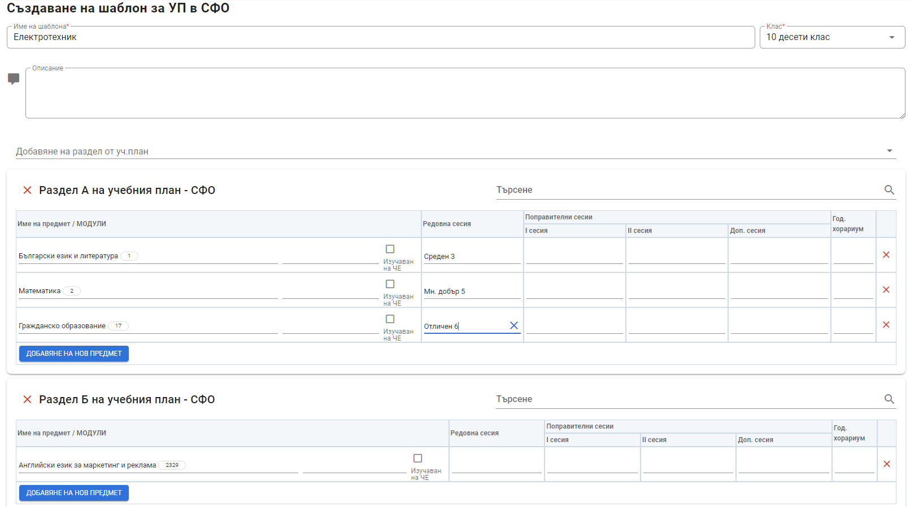

За да въведете резултати от изпити за ученик в СФО, изберете меню "Оценки" в ЛОД и натиснете бутон **Нов запис**. Изберете учебна година, випуск (клас) и от бутон "Зареди шаблон"
изберете шаблона, върху който желаете да работите. **Ако в падащото меню за избор на шаблон липсват данни, то няма нито един създаден шаблон за випуска, който е избрания ученик!**

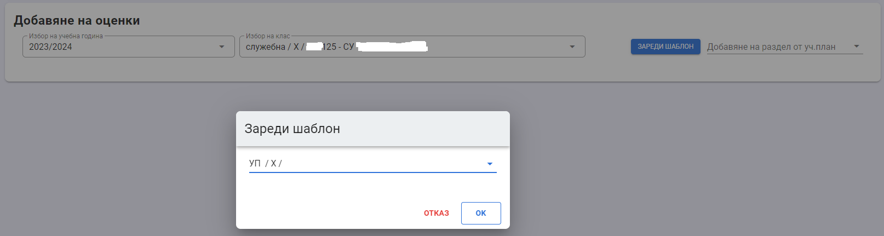

Използването на шаблон е функционалност, която цели да улесни въвеждането на данни в НЕИСПУО. Когато се работи в ЛОД на конкретен ученик е възможно всички данни, които се заредят от шаблона,
да се променят според нуждите - да се изтрие предмет, да се добави нов, да се добави нов раздел от учебния план и др. Не е необходимо за всеки ученик да се прави отделен шаблон.
Резултати от изпити, положени от ученици в СФО, може да се въвеждат и без да се използва шаблон.

Когато ученик не е положил успешно даден изпит по учебен предмет, това трябва да се отрази в ЛОД. При последващо явяване на поправителни сесии, резултатите се нансят чрез редакция на вече въведените данни
от редовната сесия.

В случай че ученик полага изпити за два класа в рамките на една учебна година, следвайте долуописаните стъпки:
1. В началото на учебната година ученикът трябва да е записан в служебната паралелка в съоветния випуск;
2. След успешно полагане на изпитите по учебни предмети въведете в ЛОД резултатите за този випуск. **НЕ ЗАКЛЮЧВАЙТЕ ЛОД!!!**
3. Редактирайте випуска на ученика;

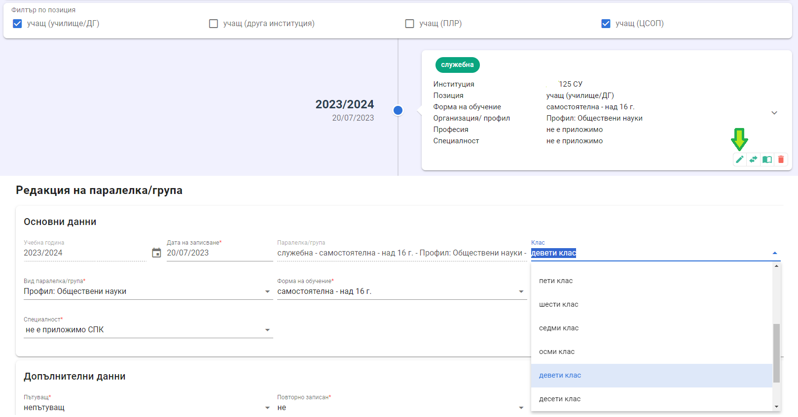

4. Нанесете резултатите от следващата сесия чрез създаване на **нов** запис в ЛОД, меню "Оценки";
5. В края на учебната година приключете (подпишете) ЛОД.

## НВО/ДЗИ
В този раздел на ЛОД се визуализират резултати от Национално външно оценяване и Държавни зрелостни изпити. **Тук данни не може да се въвеждат**. Информацията се получава чрез автоматизиран обмен с 
Единната информационна система за изпити и прием (ЕИСИП). Резултатите се прехвърлят автоматично при създаване на удостоверения, свидетелства и дипломи. При импорт на файл с документи в
Регистър "дипломи", генериран от външно приложение, се извършва проверка за съответствие на въведените в документа резултати и получените от ЕИСИП. При несъответствие на точки или оценка,
импортът на файла приключва с **грешка**.

:::danger
Зареждането на резултати от НВО и ДЗИ се инициира от администраторите на ЕИСИП и не зависи от НЕИСПУО!
:::

## Приравняване
В този раздел на ЛОД се описват всички резултати от положени от ученика приравнителни изпити. Въведените резултати се визуализират в раздел "Оценки" на ЛОД и се зареждат автоматично
при създаване на удостоверения, свидетелства и дипломи.

За добавяне на резултати от приравнителни изпити се използва бутон **Нов запис**.
При натискане на бутона се отваря нов екран за вписване на данни.

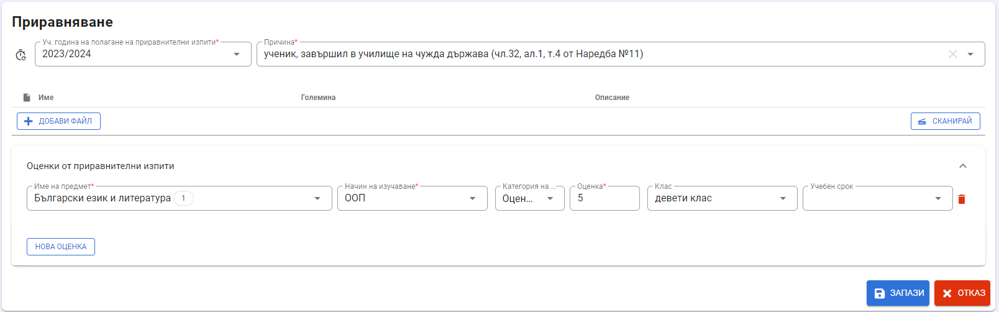

Резултатите от приравнителни изпити се описват със следните полета:
- Учебна година на полагане на изпитите;
- Основание за полагане на изпитите;
- Учебен предмет и оценка;
- Випуск (клас);
- Учебен срок. **Когато изпитът е за определяне на годишна оценка, това поле се оставя празно!**

## Признаване
В този раздел на ЛОД се описват всички признати оценки по учебни предмети. Въведените резултати се визуализират в раздел "Оценки" на ЛОД и се зареждат автоматично
при създаване на удостоверения, свидетелства и дипломи.

За добавяне на данни за признаване се  използва бутон **Нов запис**.
При натискане на бутона се отваря нов екран за вписване на данни.

- Учебна година на издаване на документа за признаване;
- Документ № на РУО/директор за признаване;
- Дата на документ на РУО/директор за признаване;
- Образователно ниво - избор от падащо меню;
- Оценки от признати учебни предмети - за добавяне на оценки натиснете бутон **Нова оценка**;

## Изпити за промяна на оценка
В този раздел на ЛОД се въвежда информация за резултати от положени изпити за промяна на оценка по реда на Чл.33, ал.2 и ал. 3, Чл.35 и Чл.36 от Наредба № 11/01.09.2016 г. за оценяване на резултатите от обучението на учениците. Изпитите за промяна на оценка са:
- Поправителни изпити - **не са обект на този раздел на ЛОД**. Резултати от тези изпити се нанасят в дневника и автоматично се визуализират и в ЛОД, раздел **Оценки**;
- Изпити за промяна на годишна оценка - за VII клас, за ХI клас и за ХII клас;
- Изпити за промяна на окончателна оценка при завършване на първи и на втори гимназиален етап на средното образование.

:::warning
Оценките, въведени тук, ще бъдат използвани за изчисляване и попълване на резултатите по учебни предмети в документите по Приложение №4 на Наредба №8/2016 г. за информацията и документите за системата на предучилищното и училищното образование!
:::

## Документи за валидиране
Документите за валидиране се създават и отпечатват по начина, описан в раздел "Дипломи"

## Други документи
В този раздел се добавят документи, издадени (и отпечатани) от външни приложения, извън Регистъра на документите. За да издадете документ в обхвата на Регистъра, изберете меню **Дипломи**.

## ПЛР - Ранно оценяване
Ранното оценяване на потребностите от подкрепа за личностно развитие на децата се извършва в процеса на предучилищното образование от педагогическите специалисти в детската градина. Ранното оценяване се извършва на децата от 3 години до 3 години и 6 месеца при постъпване за първи път на детето в детската градина чрез скрининг за определяне на риск от възникване на обучителни затруднения.
В този раздел на ЛОД се попълват данни съгласно **Наредба за пробщаващото образование**, Глава втора. Условия и ред за осигуряване на ОПЛР на децата и учениците, Раздел I. Ранно оценяване на потребностите от ПЛР в предучилищното образование.

Данните се въвеждат в **ЛОД**, раздел **ПЛР**, подраздел **Ранно оценяване**.

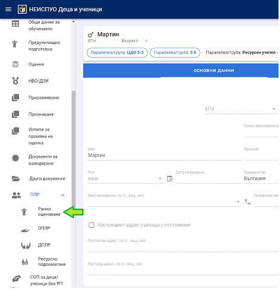
## ОПЛР
В този раздел на ЛОД се попълват данни съгласно **Наредба за пробщаващото образование**, Глава втора. Условия и ред за осигуряване на ОПЛР на децата и учениците, Раздел II. Осигуряване на ОПЛР в детската градина и в училището.

Данните се въвеждат в **ЛОД**, раздел **ПЛР**, подраздел **ОПЛР**.

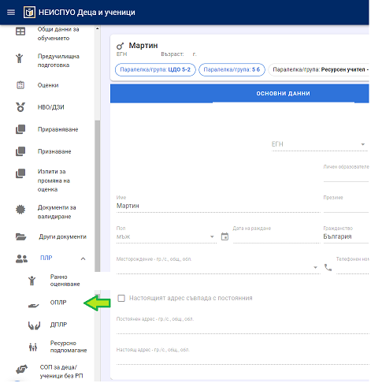
## ДПЛР
В този раздел на ЛОД се попълват данни съгласно **Наредба за приобщаващото образование**, Глава четвърта. Условия и ред за осигуряване на ДПЛР на децата и учениците, Раздел I. Оценка на индивидуалните потребности на детето и ученика за осигуряване на ДПЛР и Раздел II. Осигуряване на ДПЛР на децата и учениците.

Данните се въвеждат в **ЛОД**, раздел **ПЛР**, подраздел **ДПЛР**.

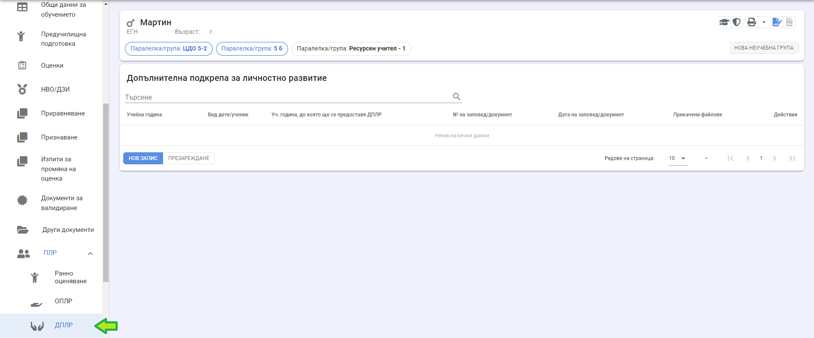

:::danger
Считано от **12.11.2024 г.** в този раздел на ЛОД следва да се въвеждат данни за деца и ученици, вкл. със специални образователни потребности (СОП), за които се осигурява ДПЛР, вкл. и **ресурсно подпомагане**.

Съществуващите менюта **Ресурсно подпомагане** и **СОП** се използват по следния начин:

- Ресурсно подпомагане - визуализира данни, въведени до 11.11.2024 г., и дава възможност за тяхната редакция. Информация за РП, определено с нова заповед на РЦПППО, се въвежда от меню **ДПЛР**.
- СОП - визуализира данни, въведени до 11.11.2024 г., и дава възможност за тяхната редакция. Нова информация за СОП на децата и учениците, за които ще се осигурява ДПЛР - Ресурсно подпомагане, определено с нова заповед на РЦПППО, се въвежда от меню **ДПЛР**. Нова информация за СОП на деца и ученици, за които не е определена необходимост от ДПЛР, се въвежда от меню **СОП (деца/ученици без РП)**.

НЕ Е НЕОБХОДИМО:
- ПОВТОРНО ДА СЕ ВЪВЕЖДАТ ДАННИ ЗА РП И СОП ЗА 2024/2025 УЧЕБНА ГОДИНА В РАЗДЕЛ ДПЛР НА ЛОД;
- ЗА ВЕЧЕ ВЪВЕДЕНАТА ИНФОРМАЦИЯ ЗА РП ДА СЕ ПРИКАЧВАТ ЗАПОВЕДТА НА РЦПППО, КАРТАТА ЗА ОЦЕНКА И ПЛАНА ЗА ПОДКРЕПА.

**В РАЗДЕЛ ДПЛР СЕ ВЪВЕЖДА ИНФОРМАЦИЯ САМО ЗА ЗАПОВЕДИ НА РЦПППО, ИЗДАДЕНИ СЛЕД 11.11.2024 г.**
:::

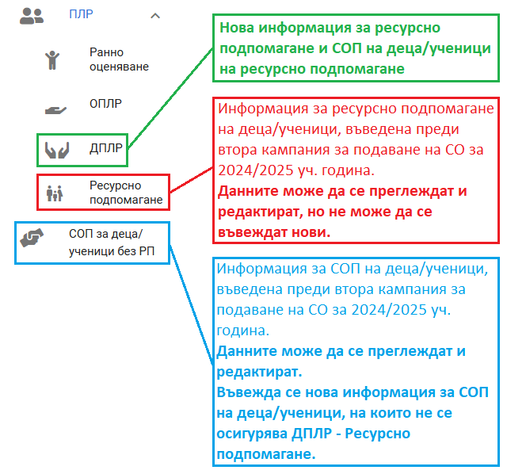

Данните за ДПЛР са организирани в два раздела - **ОБЩИ** и **ДЕЙНОСТИ ЗА ДПЛР**

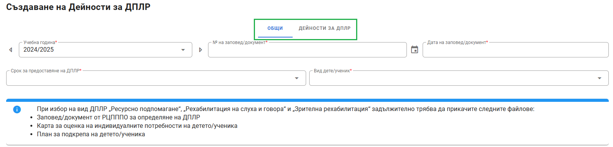

:::warning
Бутонът за запис на данните става видим и достъпен, когато в раздел **Дейности за ДПЛР** има въведена поне една дейност за ДПЛР.
:::

Информация за оценката на индивидуалните потребности на детето/ученика и осигуряването на ДПЛР се въвежда със следните уточнения:
1. Предоставянето на ДПЛР може да е за една учебна година или за етап. При избор на етап, задължително се посочва учебната година, до която (**включително**) ще се осигурява ДПЛР.

:::info
При избор на учебна година, до която ще се осигурява ДПЛР, въведените данни за РП и СОП ще се копират автоматично при преминаване в нова учебна година и няма да се налага да се въвеждат отново в началото на всяка следваща година.
:::

2. При въвеждане на данни за ДПЛР, която се осигурява на дете/ученик със СОП, задължително трябва да се посочи вида (един или повече) на специалните образователни потребности.

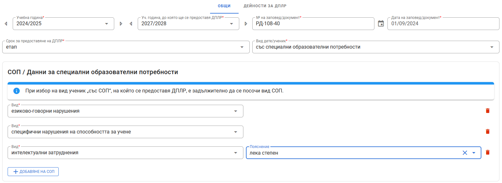

Ако в ЛОД има въведени данни за СОП на дете/ученик, но не е имало необходимост от осигуряване на ДПЛР и тази необходимост възниква впоследствие, то при въвеждане на информацията за ДПЛР, наличните данни за СОП се зареждат автоматично и не е необходимо да се въвеждат повторно.

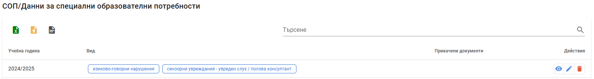
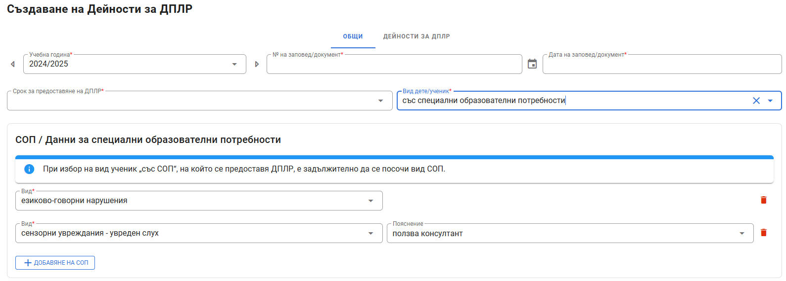

3. За ДПЛР Ресурсно подпомагане, рехабилитация на слуха и говора и зрителна рехабилитация задължително трябва да бъдат прикачени заповедта/решението на РЦПППО за определяне на ДПЛР, картата за оценка на индивидуалните потребности и плана за подкрепа на детето/ученика. 

Информация за дейностите по ДПЛР се въвеждат в раздела **Дейности за ДПЛР**.

При избор на Вид подпомагане „Ресурсно подпомагане“, „Рехабилитация на слуха и говора“ или „Зрителна рехабилитация“:
- трябва да се посочи вида на институцията, която ще осъществява ресурсното подпомагане
- поне един от посочените специалисти трябва да е ресурсен учител, а при избрана „Рехабилитация на слуха и говора“ и/или „Зрителна рехабилитация“ – специалист по сензорни увреждания
- не се допуска посочването на повече от един специалист от всеки вид (напр. не е възможно въвеждането на повече от един ресурсен учител)
- задължително е да се въведат часовете, с които се работи седмично с детето/ученика съгласно плана за подкрепа
- взетите часове от всеки специалист от ЕПЛР се изчисляват от взетите теми, отбелязани в електронния дневник

В зависимост от конкретния случай, заповедта на РЦПППО за определяне на ДПЛР и възможностите на институцията, в която детето/ученикът се обучава са възможни различни варианти на осъществяване на ДПЛР. В следващите примери са описани най-често срещаните случаи и начините на отразяване на информацията в ЛОД на децата и учениците.

**Пример 1**

Съгласно заповедта на РЦПППО е определено ресурсно подпомагане от екип от ресурсен учител, логопед и психолог. Училището, в което ученикът се обучава, може да осигури необходимите специалисти.

В ЛОД на ученика ДПЛР се въвежда, като:
- в раздел дейности за ДПЛР се добавя вид подпомагане "Ресурсно подпомагане"
- в полето "Извършва се от" се избира **"от училище/ДГ"**
- добавят се специалистите (ресурсен учител, психолог, логопед)
- в поле "Месторабота" се избира **"назначен в училището/ДГ"**

**Пример 2**

Съгласно заповедта на РЦПППО е определено ресурсно подпомагане от екип от ресурсен учител, логопед и психолог. ДПЛР ще се осъществява от специалисти в РЦПППО.

Училището, в което ученикът се обучава, следва да въведе в ЛОД на ученика информация за ДПЛР, като:
- в раздел дейности за ДПЛР се добавя вид подпомагане "Ресурсно подпомагане"
- в полето "Извършва се от" се избира **"от РЦПППО"**
- добавят се специалистите (ресурсен учител, психолог, логопед)
- в поле "Месторабота" се избира **"назначен в РЦПППО"**

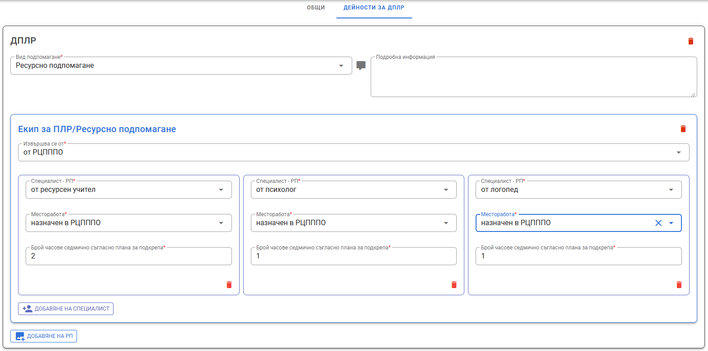

**Пример 3**

Съгласно заповедта на РЦПППО е определено ресурсно подпомагане от екип от ресурсен учител, логопед и психолог. Училището, в което ученикът се обучава, може да осигури логопед и психолог, но ресурсният учител се осигурява от РЦПППО.

Училището, в което ученикът се обучава, следва да въведе в ЛОД на ученика информация за ДПЛР, като:
- в раздел дейности за ДПЛР се добавя вид подпомагане "Ресурсно подпомагане"
- в полето "Извършва се от" се избира **от РЦПППО**
- добавя се специалист - ресурсен учител
- в поле "Месторабота" се избира **назначен в РЦПППО**

- добавя се още една карта за ресурсно подпомагане
- в полето "Извършва се от" се избира **от училище/ДГ**
- добавят се специалисти - логопед и психолог
- в поле "Месторабота" се избира **назначен в училището/ДГ**

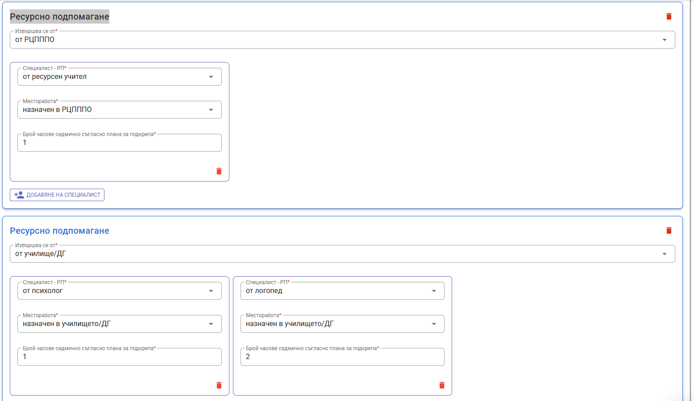

**Пример 4**

Съгласно заповедта на РЦПППО е определено ресурсно подпомагане от екип от ресурсен учител, логопед и психолог. Училището, в което ученикът се обучава, може да осигури логопед и психолог, но ресурсният учител се осигурява от друго училище/ДГ.

Училището, в което ученикът се обучава, следва да въведе в ЛОД на ученика информация за ДПЛР, като:
- в раздел дейности за ДПЛР се добавя вид подпомагане "Ресурсно подпомагане"
- в полето "Извършва се от" се избира **училище/ДГ**
- добавя се специалист - ресурсен учител, за който в поле "Месторабота" се избира **назначен другаде**
- добавят се специалисти - психолог и логопед, за които в поле "Месторабота" се избира **назначен в училището/ДГ**

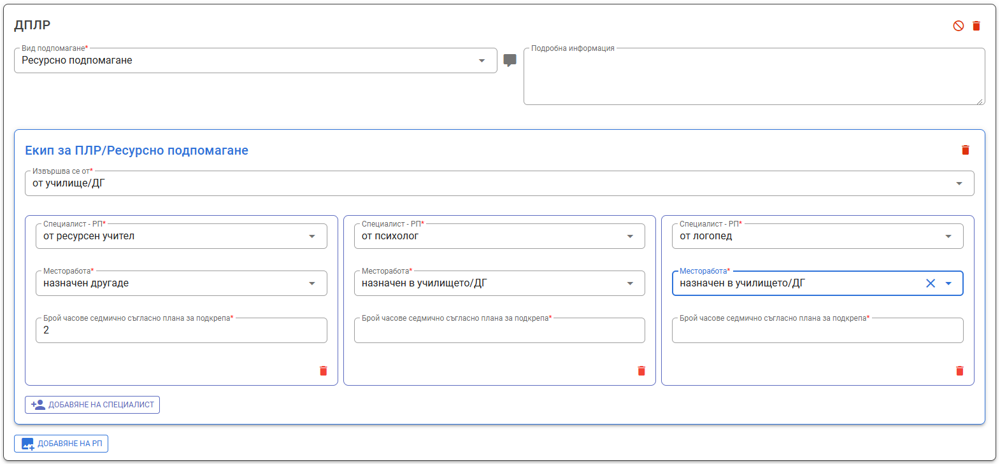

**Пример 5**

Съгласно заповедта на РЦПППО е определено ресурсно подпомагане от екип от ресурсен учител, логопед и специалист по сензорни увреждания поради увреден слух на ученика. Училището, в което ученикът се обучава не е училище за обучение и подкрепа на деца със сензорни увреждания и може да осигури ресурсен учител и логопед, но специалистът по сензорни увреждания се осигурява от училище за обучение и подкрепа на деца със сензорни увреждания.

Училището, в което ученикът се обучава, следва да въведе в ЛОД на ученика информация за ДПЛР, като:
- в раздел дейности за ДПЛР се добавя вид подпомагане "Ресурсно подпомагане"
- в полето "Извършва се от" се избира **училище/ДГ**
- добавят се специалистите (ресурсен учител и логопед)
- в поле "Месторабота" се избира **назначен в училището/ДГ**

- добавя се още една дейност за ДПЛР - вид "Рехабилитация на слуха и говора"
- в полето "Извършва се от" се избира **училище за обучение и подкрепа на ученици със сензорни увреждания**
- добавят се специалист от училище за обучение и подкрепа на у-ци със сензорни увреждания 
- в поле "Месторабота" се избира **назначен другаде**

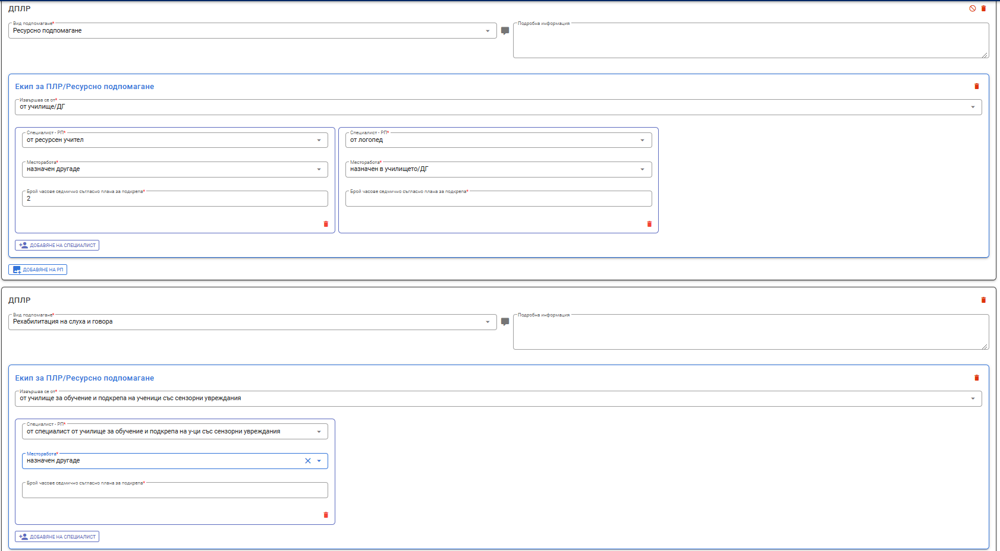

### Прекратяване на дейност за ДПЛР

Дейностите за ДПЛР могат да бъдат прекратявани, без това да е свързано с тяхното изтриване от системата. Това се извършва от бутон **Прекратяване** в раздел **Дейности за ДПЛР**

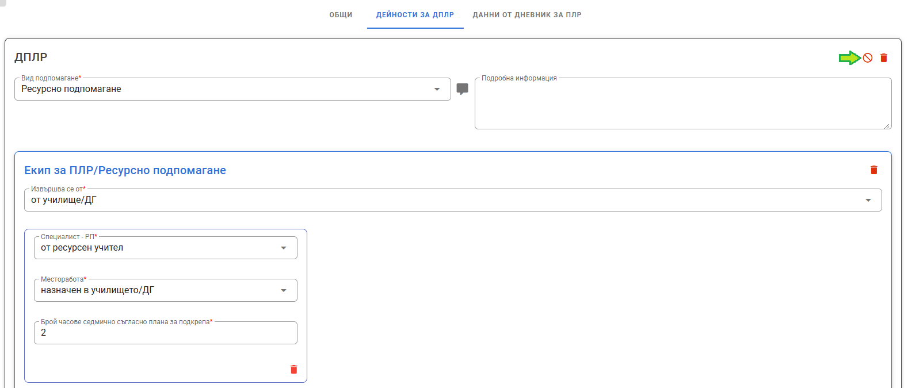

Задължително се посочва дата на прекратяване и причина за прекратяването. Има възможност и за прикачване на файлове.

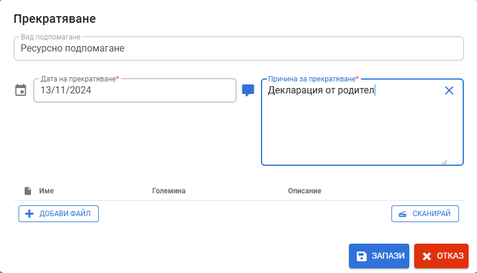

Ако към избраната дата на прекратяване на ДПЛР детето/ученикът е записан в група от вид „Група за ресурсно подпомагане“ и/или е включен в дейност за ПЛР от вид „ДПЛР – рехабилитация на слуха и говора“, „ДПЛР – зрителна рехабилитация“, „ДПЛР – ресурсно подпомагане“, се сигнализира съобщение за грешка и не се позволява запис на данните за прекратяване. Необходимо е първо детето/ученикът да се отпише от групата за ресурсно подпомагане.

## СОП (деца/ученици без ДПЛР) 

В този раздел на ЛОД се въвежда информация за специални образователни потребности на децата и учениците. Данните се въвеждат за всяка учебна година, като при преминаване в нова учебна година те се копират автоматично.

:::danger
От 12.11.2024 г. тук следва да се въвеждат данни за СОП на деца и ученици, за които не се осигурява ДПЛР (ресурсно подпомагане).

Информация за СОП на децата и учениците, за които се осигурява ДПЛР (ресурсно подпомагане), се въвежда от меню **ДПЛР**.
:::
## Ресурсно подпомагане

В този раздел на ЛОД се визуализира информация за ресурсно подпомагане на децата и учениците, като въведените до 11.11.2024 г. данни може да се редактират. Информация за РП, определено с нова заповед на РЦПППО, се въвежда от меню **ДПЛР**.
## Стипендии
В този раздел на ЛОД се въвеждат данни за стипендии на учениците.

## Награди

## Санкции
В този раздел на ЛОД се въвеждат данни за наложени санкции на учениците.

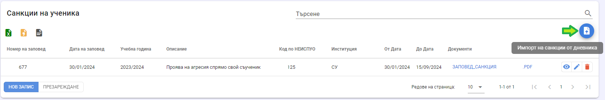

Санкциите могат да бъдат въведени ръчно или да се импортират от дневника чрез бутон **Импорт на санкции от дневника**.

## Ученическо самоуправление
В този раздел на ЛОД се въвеждат данни за участието на учениците в различните форми на ученическо самоуправление.
Само учениците, които участват в ученически съвет на класа (паралелката) с позиция "Председател", могат да бъдат избирани за членове на ученическия съвет на училището.

## Международна мобилност

## Приключване на ЛОД
Тук се визуализира статуса на ЛОД за всяка учебна година след 2021/2022. От бутон **Подписване на ЛОД** се извършва подписване за съответната учебна година, с чрез бутон **Отмяна на подпис на ЛОД**
ЛОД се отключва за избраната учебна година.

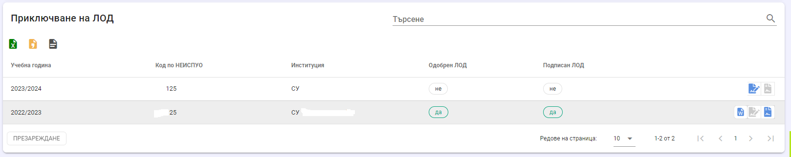

:::info
Само потребителят, който е подписал ЛОД, може да отключи делото. Тук се включва и институционалният акаунт. В случай че ЛОД е подписан от личен потребителски профил на директор, който вече не заема тази длъжност, създайте заявка в системата за поддръжка на НЕИСПУО за служебно отключване на ЛОД.
:::
