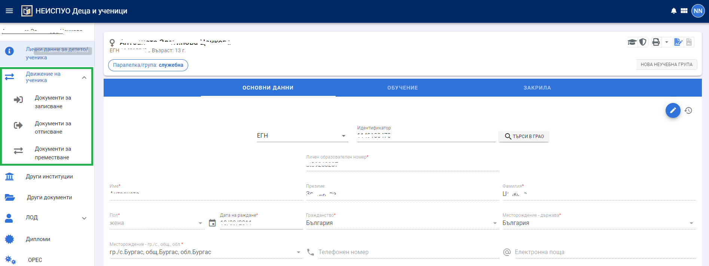
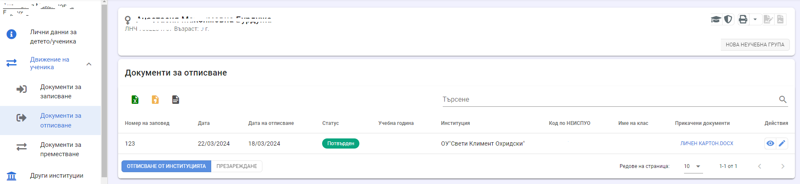
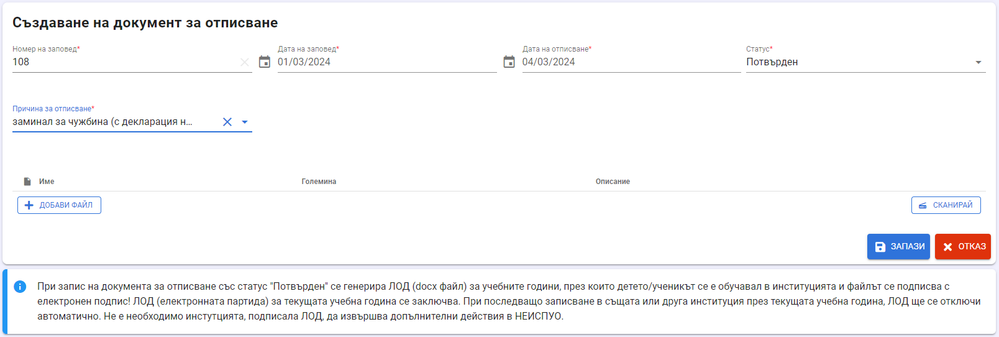
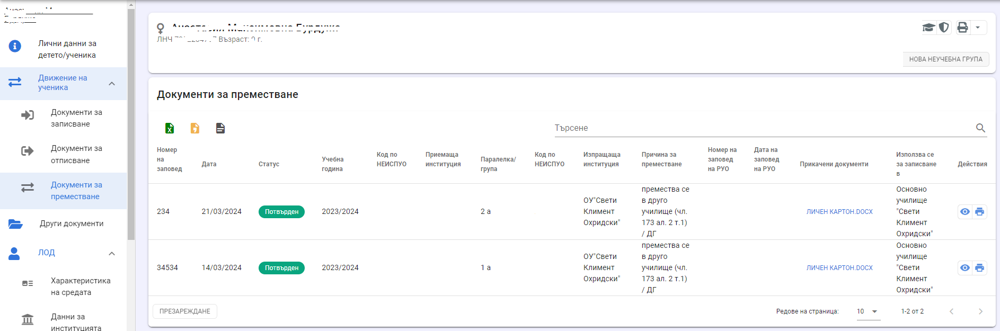
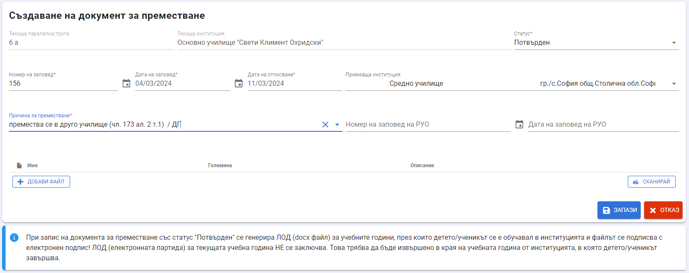
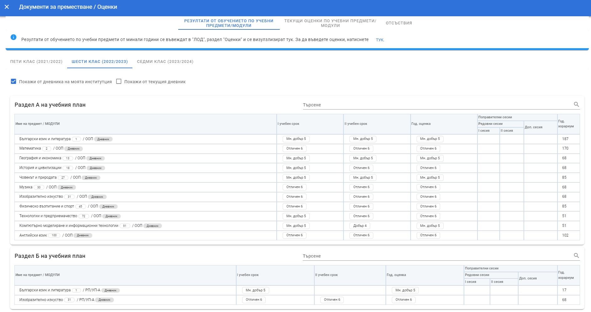
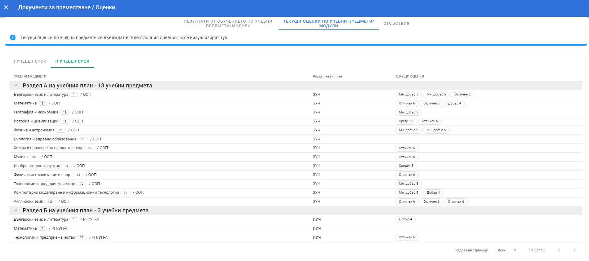
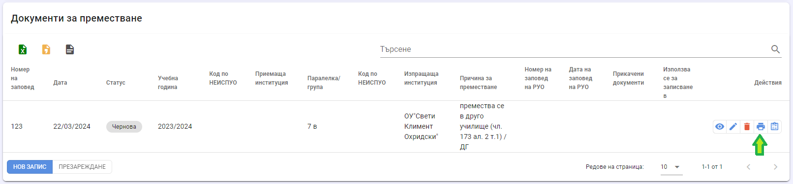

# Движение на дете/ученик

За записване, преместване и отписване на дете/ученик в/от институция се създават съответните документи,
достъпни в профила на ученика, меню **Движение на
ученика**.

:::info
Документите за движение имат два статуса - "чернова" и "потвърден". Документи със статус "Чернова" могат да бъдат променяни и създаването им не води до записване или отписване на детето/ученика в/от институцията. Документите за движение се прилагат, когато статусът е "потвърден".
:::

## Документи за записване

При избор на документи за записване се отваря списък с всички създадени
документи за записване в НЕИСПУО за детето/ученика (ако има такива) и
опция за създаване на нов документ от бутон **Нов запис**.

От бутон **Нов запис** се отваря бланка за създаване на нов
документ за записване.

В случай че данните за заповедта за записване са неприложими, в полето "Номер" въведете тире "-" и изберете текуща дата.
Ако детето/ученикът се премества от друга институция и има създаден в НЕИСПУО документ за преместване, той може да бъде избран
в полето "Номер на удостоверение за преместване" (**не е задължително**).

**Позиция**

Полето позиция е от изсключително значение за данните за децата и учениците в НЕИСПУО.
- Учащ (училище/ДГ) - посочва се за деца и ученици, които ще се обучават в институцията;
- Учащ (ЦСОП) - посочва се за деца и ученици, които се записват в институцията, но ще се обучават изнесено в ЦСОП;
- Учащ (друга институция) - посочва се от ЦСОП за деца и ученици, обучаващи се изнесено в центъра. Посочва се и от институции, в които се записват ученици, обучаващи се по учебен предмет,
който не може да бъде изучаван в училището, в което ученикът се обучава.
- Учащ (ПЛР) - посочва се за всички деца и ученици в ЦПЛР, СОЗ и самостоятелни общежития, както и от училища и ДГ за деца и ученици,
на които в институцията се оказва само подкрепа за личностно развитие (несамостоятелно общежитие, логопед, психолог, ресурсно подпомагане и др.)

След като бъде записан документът (**със статус "потвърден"), детето/ученикът се счита за записан в институцията и следва
да се разпредели в паралелка/група.

::: danger Внимание!
След запис на документа позицията не може да бъде променяна!
Промяна на позицията се извършва от екипа по поддръжка на НЕИСПУО след подаване на заявка в системата за поддръжка.
:::

## Документи за отписване

Документ за отписване се създава, когато дете/ученик напуска системата на предучилищното и училищното образование -
 например заминава за чужбина, не подлежи на задължително обучение и др.

При избор на документи за отписване се отваря списък с всички създадени
документи за отписване в НЕИСПУО за детето/ученика (ако има такива) и
опция за създаване на нов документ от бутон **Отписване от институцията**.

От бутон **Отписване от институцията** се отваря бланка за създаване на нов
документ за отписване.

В случай че данните за заповедта за отписване са неприложими, в полето "Номер" въведете тире "-" и изберете текуща дата.

При запис на документ за отписване със статус "Потвърден" автоматично се генерира ЛОД (docx файл) за учебните години,
през които детето/ученикът се е обучавал в институцията и файлът автоматично се подписва с електронен подпис!
ЛОД (електронната партида) за текущата учебна година се заключва. ЛОД трябва да се разпечата и да се съхранява и на 
хартиен носител.

**При последващо записване в същата или друга
институция през текущата учебна година, ЛОД ще се отключи автоматично. 
НЕ Е необходимо инстутцията, подписала ЛОД, да извършва допълнителни действия в НЕИСПУО.**

::: danger Внимание!
При запис на документ за отписване със статус "потвърден" детето/ученикът ще бъде отписан от институцията и 
няма да има възможност да се извършват каквито и да било промени в ЛОД!
:::
## Документи за преместване

При избор на документи за преместване се отваря списък с всички създадени
документи за преместване в НЕИСПУО за детето/ученика (ако има такива) и
опция за създаване на нов документ от бутон **Нов запис**.

Чрез избор на бутон **Нов запис** се отваря бланка за създаване на нов
документ за преместване.

В случай че данните за заповедта за преместване са неприложими, в полето "Номер" въведете тире "-" и изберете текуща дата. Не е задължително да се избира приемаща институция,
но е препоръчително. При избрана приемаща институция, само потребител, асоцииран към тази институция, ще може да запише детето/ученика.

При запис на документа за преместване със статус "Потвърден" се генерира ЛОД (docx файл) за учебните години,
през които детето/ученикът се е обучавал в институцията и файлът се подписва с електронен подпис!
ЛОД (електронната партида) за текущата учебна година **НЕ** се заключва. Това трябва да бъде извършено в края на учебната
година от институцията, в която детето/ученикът завършва.

::: danger Внимание!
При запис на документ за преместване със статус "потвърден" детето/ученикът ще бъде отписан от институцията и 
няма да има възможност да се извършват каквито и да било промени в ЛОД!
:::
## Удостоверение за преместване
След запис на документ за преместване със статус "чернова", може да бъде отпечатано удостоверение за преместване.

От бутон **Оценки** могат да бъдат разгледани оценките на ученика, които ще бъдат отпечатани в удостоверението.

Резултати от обучението по учебни предмети от минали години, както и срочни оценки за текущата учебна година се зареждат от ЛОД, 
раздел "Оценки" и само се визуализират в удостоверението за преместване. **Не могат да бъдат променяни!** 
За да промените оценка в документа, трябва да извършите корекция в споменатия раздел на ЛОД.

Текущите оценки се зареждат от дневника на паралелката, в която ученикът е записан и само се визуализират в удостоверението за преместване.
**Не могат да бъдат променяни!** За да промените текуща оценка в документа, трябва да извършите корекция в дневника.

Опцията, която по подразбиране е маркирана, *"Покажи от дневника на моята институция"* служи за филтриране (скриване) на оценки от други институции, 
в които ученикът е бил през текущата или минали учебни години.

Опцията *"Покажи от текущия дневник"* служи за филтриране (скриване) на оценки от друг дневник на институцията, 
в случай че ученикът е преместван от една паралелка в друга.

Разпечатването на удостоверението за преместване се извършва от бутон **Печат**.

За удостоверенията за преместване със статус "потвърден", бутонът за преглед на оценките не е достъпен.
