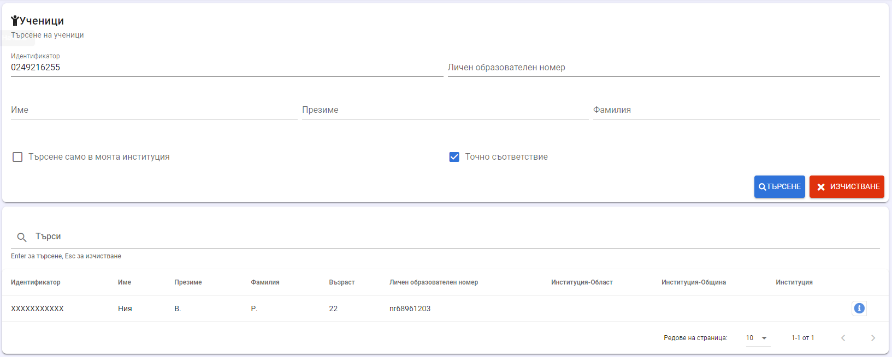

# Търсене на дете/ученик

Имате възможност да търсите по множество показатели:

-   Идентификатор (ЕГН, ЛНЧ, ИДН);

-   Личен образователен номер;

-   Име;

-   Презиме;

-   Фамилия;

-   Търсене само в моята институция - при поставена отметка, системата ще търси деца и ученици по зададените критерии само измежду лицата, записани във Вашата институция;

-   опция Точно съвпадение - ако е поставена отметката, системата ще
    покаже само резултатите, които имат точно съвпадение със зададените
    критерии за търсене.

След въвеждане на критерии за търсене и натискане на бутон **Търсене**,
система извежда на екрана получените резултати.

За изчистване на всички полета в екрана за търсене трябва да се натисне
бутон **Изчистване**. След което може да се започне ново търсене с нови
критерии.

**Моля, използвайте търсене по идентификатор (ЕГН/ЛНЧ/ИДН)!!!** Търсенето по имена може да доведе до погрешно записване в институция на дете/ученик или преподавател,
чиито имена съвпадат с тези на друго лице в НЕИСПУО.
